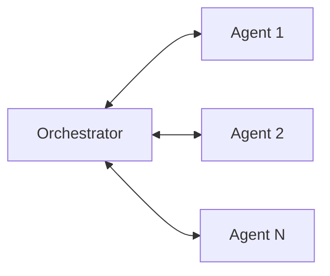
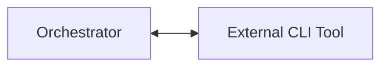

# MessageChannel

The `MessageChannel` class serves as the core communication infrastructure in PyOrchestrate, providing a unified interface for message passing between different system components.

## Architecture Overview

### Core Design Principles

The `MessageChannel` class is the internal backbone for communication between the main components of PyOrchestrate. It provides two distinct communication mechanisms:

1. **Queue-based MessageChannel**: Used for communication between the orchestrator and its agents.
2. **Socket-based MessageChannel**: Used for communication between the orchestrator and external CLI tools. This uses UNIX domain sockets and is also bidirectional, but designed for integration with external processes.

::: tip
For user-facing or custom communication needs, PyOrchestrate provides a flexible plugin system [Communication Plugins](../../learn/agents/plugins/communication-plugins.md) that users can extend and configure as needed.
:::

#### 1. Queue-based MessageChannel

Communication between the orchestrator and agents is handled by a shared `MessageChannel` of type `process` or `thread`. This channel is always local and supports bidirectional messaging.



Only messages of type `STATUS` are sent from agents to the orchestrator. The orchestrator processes these messages and emits corresponding events through the `EventManager`.

::: warning
Currently, messages from the orchestrator to agents via the MessageChannel are not handled. Only agent-to-orchestrator communication is supported through this channel.
:::

The main events handled are:

- `AGENT_TERMINATED`: The agent has closed.
- `AGENT_STARTED`: The agent has started.
- `AGENT_READY`: The agent is ready.
- `AGENT_ERROR`: The agent reported an error (payload starts with `ERROR:`).

#### 2. Socket-based MessageChannel

Communication between the orchestrator and external CLI tools is handled by a separate `MessageChannel` of type `unix_socket`. This allows external processes to send commands and receive responses from the orchestrator.



When a message is received from the CLI via the socket-based MessageChannel, the orchestrator parses the payload as JSON, extracts the command and arguments, and delegates execution to a `CommandHandler`. The response (or error) is then sent back to the CLI through the same channel.

### Message Format

All communication uses the standardized `ServiceMessage` dataclass:

```python
@dataclass
class ServiceMessage:
    sender: str
    type: Literal["COMMAND", "STATUS"] 
    payload: str
    timestamp: datetime
```
