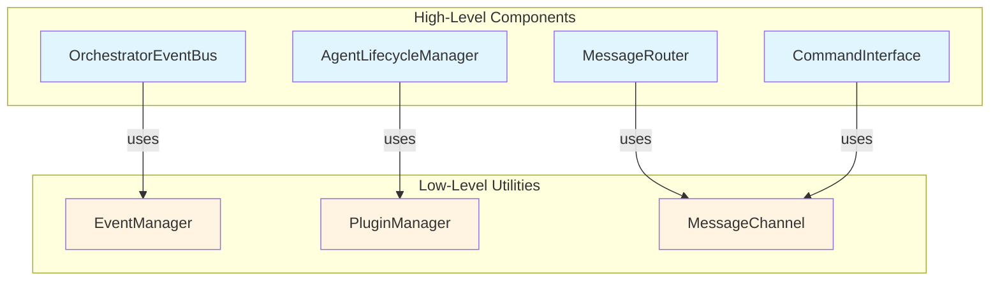
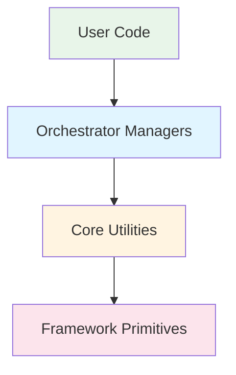

# Core Utilities

This section documents the **low-level utility components** of PyOrchestrate that provide foundational infrastructure for the framework. These utilities are used internally by higher-level components like the orchestrator managers and agents.

::: tip Understanding the Architecture
These utilities are **building blocks** used by the framework's higher-level components. If you're learning about orchestrator internals, see the [Orchestrator Internals](../orchestrator-internals/) section to understand how these utilities are composed into specialized managers.
:::

## Overview

PyOrchestrate's utility layer provides three core low-level components:

| Utility | Purpose | Used By |
|---------|---------|---------|
| **[EventManager](./event-manager.md)** | Callback-based event system | OrchestratorEventBus |
| **[PluginManager](./plugin-manager.md)** | Plugin lifecycle management | AgentLifecycleManager, Agents |
| **[MessageChannel](./message-channel.md)** | Inter-process communication | MessageRouter, CommandInterface |

## Architectural Context

### How Utilities Fit Into the Framework



::: tip Key Principle
You typically interact with **high-level managers** (blue), which internally use these **low-level utilities** (yellow).
:::

## Available Utilities

### [Event Manager](./event-manager.md)
The Event Manager provides a callback-based event notification system. It's used internally by `OrchestratorEventBus` to execute registered callbacks when events occur.

**Key Features**:
- Event callback registration and execution
- Asynchronous callback execution via thread pool
- Parameter filtering based on callback signatures
- Error isolation between callbacks

**Used By**: OrchestratorEventBus (combines EventManager + EventStore)

### [Plugin Manager](./plugin-manager.md)  
The Plugin Manager handles plugin lifecycle operations including initialization, finalization, and owner reference management.

**Key Features**:
- Plugin discovery and extraction
- Plugin initialization and finalization
- Owner reference management
- Hierarchical plugin definition support

**Used By**: AgentLifecycleManager (for agent plugin management), BaseAgent, BaseOrchestrator

### [Message Channel](./message-channel.md)
The Message Channel provides process-safe message passing between framework components using structured message envelopes.

**Key Features**:
- Process-safe communication (ZeroMQ-based)
- Structured message format (COMMAND, STATUS)
- Request/response correlation
- Transport abstraction

**Used By**: MessageRouter (agent→orchestrator), CommandInterface (CLI→orchestrator)

## When to Use These Utilities Directly

### Typical Use (Indirect)

Most users interact with these utilities **indirectly** through higher-level APIs:

```python
# You use high-level APIs
orchestrator.event_bus.register_callback(event, callback)  # Uses EventManager internally
orchestrator.register_agent(MyAgent, "worker")             # Uses PluginManager internally

# The framework handles the low-level utilities
```

### Advanced Use (Direct)

You might use these utilities directly when:

1. **Building Custom Components**: Extending the framework with custom managers or agents
2. **Plugin Development**: Creating custom plugins that need lifecycle management
3. **Testing**: Unit testing framework components with mocked utilities
4. **Debugging**: Inspecting internal framework behavior

## Integration Patterns

### Agents Automatically Use Utilities

```python
from PyOrchestrate.core.agents.base_agent import BaseAgent

class MyAgent(BaseAgent):
    def __init__(self, config):
        super().__init__(config)
        
        # Utilities are automatically available
        # (managed by the framework)
        self.plugin_manager   # Manages agent plugins
        self.message_channel  # Communication with orchestrator
```

### Orchestrator Managers Compose Utilities

```python
from PyOrchestrate.core.orchestrator import Orchestrator

orchestrator = Orchestrator()

# High-level managers use utilities internally
orchestrator.event_bus          # Uses EventManager + EventStore
orchestrator.lifecycle_manager  # Uses PluginManager
orchestrator.message_router     # Uses MessageChannel
orchestrator.command_interface  # Uses MessageChannel
```

## Best Practices

### 1. Use High-Level APIs When Possible

```python
# ✅ Good: Use high-level API
orchestrator.event_bus.register_callback(event, callback)

# ❌ Avoid: Direct low-level access (unless necessary)
orchestrator.event_bus.event_manager.register_callback(...)
```

### 2. Understand the Abstraction Layers



- **User Code**: Your application logic (agents, orchestrators)
- **Orchestrator Managers**: High-level components (OrchestratorEventBus, MessageRouter, etc.)
- **Core Utilities**: Low-level building blocks (EventManager, MessageChannel, PluginManager)
- **Framework Primitives**: Python standard library and dependencies

### 3. Consult Advanced Documentation

For understanding how these utilities are composed into higher-level functionality, see:
- [Orchestrator Internals](../orchestrator-internals/) - How managers use utilities
- [Agent Architecture](../../learn/agents/) - How agents use utilities

## Learning Path

### For Application Developers

1. Start with **[Introduction](../../learn/introduction/)** - Understand orchestrators and agents
2. Learn **[Orchestrator API](../../learn/introduction/orchestrator_api/)** - High-level usage
3. Explore **Examples** - Practical patterns

You typically won't need to interact with these utilities directly.

### For Framework Contributors

1. Read **[Orchestrator Internals](../orchestrator-internals/)** - Understand manager architecture
2. Study **Core Utilities** (this section) - Low-level building blocks
3. Review source code - Implementation details

## See Also

- [Orchestrator Internals](../orchestrator-internals/) - High-level manager architecture
- [Configuration and Validation](../config_and_validation) - Configuration management
- [Advanced Architecture](../../advanced/) - Deep architectural topics