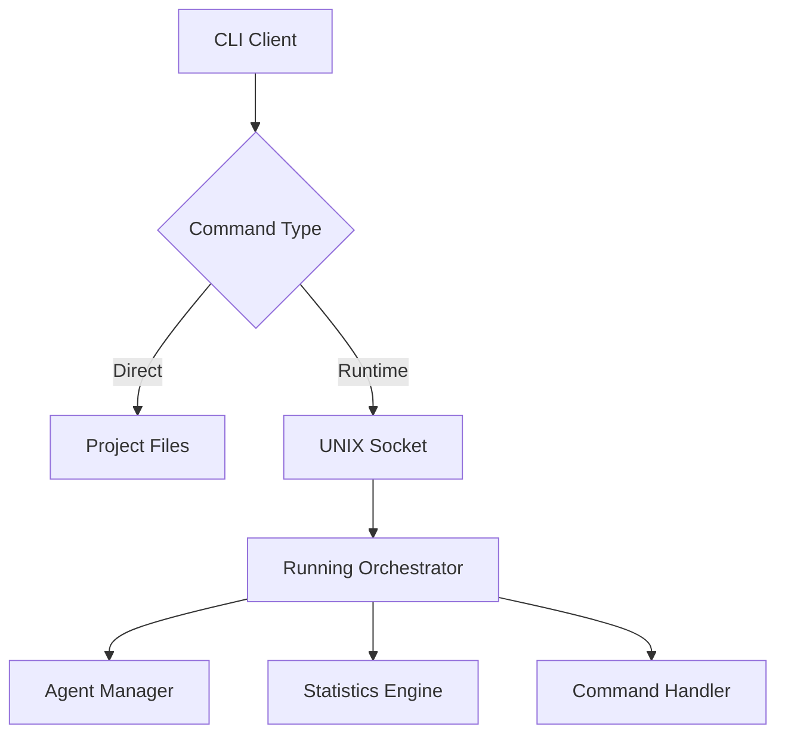

# PyOrchestrate CLI

The PyOrchestrate Command Line Interface (CLI) provides powerful tools for managing and interacting with your orchestrator and agents both during development and at runtime.

The CLI offers two main categories of functionality:

## Project Management Commands

Basic commands for project initialization and setup:

- **Project initialization**: Bootstrap new PyOrchestrate projects
- **Configuration validation**: Validate your project configuration  
- **Development utilities**: Tools for development workflows

## Runtime Commands

Advanced commands for real-time control of running orchestrators:

- **Agent monitoring**: View status and statistics of running agents
- **Dynamic control**: Start, stop, and manage agents on-demand
- **System inspection**: Get detailed reports and metrics
- **Remote management**: Control orchestrators via UNIX sockets

::: tip Real-time Control
The runtime commands enable DevOps workflows, monitoring integration, and dynamic agent management without stopping your orchestrator.
:::

## Installation

The CLI is automatically installed when you install PyOrchestrate:

```bash
pip install pyorchestrate
```

Verify the installation:

```bash
pyorchestrate --help
```

## Getting Started

### Basic Usage

```bash
# Initialize a new project
pyorchestrate init my-project

# Run basic validation
pyorchestrate validate
```

### Runtime Control

To use runtime commands, your orchestrator must be configured with the command interface enabled:

```python
# In your orchestrator configuration
class OrchestratorConfig(BaseOrchestrator.Config):
    enable_command_interface: bool = True
    command_socket_path: str = "/tmp/pyorchestrate.sock"
```

Then you can control the running orchestrator:

```bash
# List all agents and their status
pyorchestrate ps

# Get orchestrator statistics  
pyorchestrate stats

# Start a specific agent
pyorchestrate start MyAgent
```

## Architecture

The CLI consists of two main components:

### 1. Direct Commands
Commands that operate on project files and configurations without requiring a running orchestrator.

### 2. Socket-based Commands  
Commands that communicate with a running orchestrator via UNIX sockets, enabling real-time control and monitoring.



## Security Considerations

- **UNIX Sockets**: Provide secure local communication with file-based permissions
- **Command Validation**: All commands are validated before execution
- **Access Control**: Socket permissions can be configured for multi-user environments
- **Audit Logging**: All CLI commands are logged for security monitoring

## Next Steps

- Learn about [Runtime Commands](./runtime-commands) for real-time orchestrator control
- Explore [Configuration](./configuration) options for the command interface
- See practical [Examples](./examples) of CLI usage in different scenarios

The PyOrchestrate CLI bridges the gap between development and operations, providing both developer-friendly tools and production-ready management capabilities.
