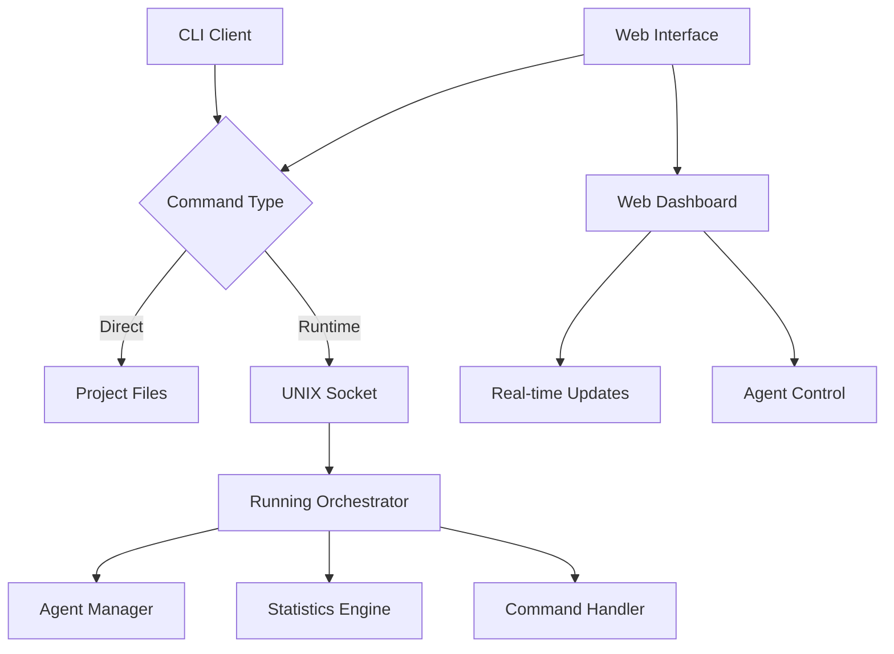

# PyOrchestrate CLI

The PyOrchestrate Command Line Interface (CLI) provides powerful tools for managing and interacting with your orchestrator and agents both during development and at runtime.

The CLI offers two main categories of functionality:

## Project Management Commands

Basic commands for project initialization and setup:

- **Project creation**: `create` - Bootstrap new PyOrchestrate projects with proper structure
- **Version information**: `--version` - Display CLI version information

## Runtime Commands

Advanced commands for real-time control of running orchestrators:

- **Agent monitoring**: `ps`/`list` - View status and statistics of running agents
- **Dynamic control**: `start`/`stop` - Start, stop, and manage agents on-demand
- **System inspection**: `status` - Get detailed reports for orchestrator or specific agents
- **Dependencies**: `dependencies` - Show agent dependency graph
- **Event tracking**: `history`/`history-stats` - Get event history and statistics
- **Real-time monitoring**: `stats` - Continuous monitoring like `docker stats`
- **Remote management**: `shutdown` - Gracefully shutdown orchestrator via UNIX sockets

## Web Interface

PyOrchestrate also provides a web-based interface for monitoring and controlling your orchestrator:

- **Web dashboard**: `pyorchestrate-web` - Launch a web interface for visual monitoring and control
- **Real-time updates**: Live dashboard with agent status, statistics, and logs
- **Authentication**: Optional token-based authentication for secure access
- **Remote access**: Web-based alternative to CLI commands

### Output Formats

All runtime commands support two output formats:
- **Table format** (`--format table`): Human-readable output with formatted tables (default)
- **JSON format** (`--format json`): Machine-readable structured output for automation

::: tip Real-time Control
The runtime commands enable DevOps workflows, monitoring integration, and dynamic agent management without stopping your orchestrator.
:::

## Installation

The CLI is automatically installed when you install PyOrchestrate:

```bash
pip install .
```

Verify the installation:

```bash
pyorchestrate --help
```

## Getting Started

### Basic Usage

```bash
# Initialize a new project
pyorchestrate create my-project

# Show CLI help
pyorchestrate --help

# Show WebServer help
pyorchestrate-web --help

# Start web interface
pyorchestrate-web --host 0.0.0.0 --port 8080 --socket /tmp/pyorchestrate.sock
```

### Runtime Control

To use runtime commands, your orchestrator must be configured with the command interface enabled:

```python
# In your orchestrator configuration
config = Orchestrator.Config(
    enable_command_interface=True,
    command_socket_path="/tmp/pyorchestrate.sock"
)
```

Then you can control the running orchestrator:

```bash
# List all agents and their status
pyorchestrate ps

# Get orchestrator statistics (real-time monitoring)
pyorchestrate stats

# Start a specific agent
pyorchestrate start MyAgent

# Get event history
pyorchestrate history --last 10

# Shutdown orchestrator
pyorchestrate shutdown

# Start web interface for visual monitoring
pyorchestrate-web --port 8080 --socket /tmp/pyorchestrate.sock
```

## Architecture

The CLI consists of two main components:

### 1. Direct Commands
Commands that operate on project files and configurations without requiring a running orchestrator.

### 2. Socket-based Commands  
Commands that communicate with a running orchestrator via UNIX sockets, enabling real-time control and monitoring.



## Security Considerations

- **UNIX Sockets**: Provide secure local communication with file-based permissions
- **Command Validation**: All commands are validated before execution
- **Access Control**: Socket permissions can be configured for multi-user environments
- **Audit Logging**: All CLI commands are logged for security monitoring

## Next Steps

- Learn about [Runtime Commands](./runtime-commands) for real-time orchestrator control
- Explore [Web Interface](./web-interface) for browser-based monitoring and control
- Check [Configuration](./configuration) options for the command interface
- See practical [Examples](./examples) of CLI usage in different scenarios

The PyOrchestrate CLI bridges the gap between development and operations, providing both developer-friendly tools and production-ready management capabilities.
