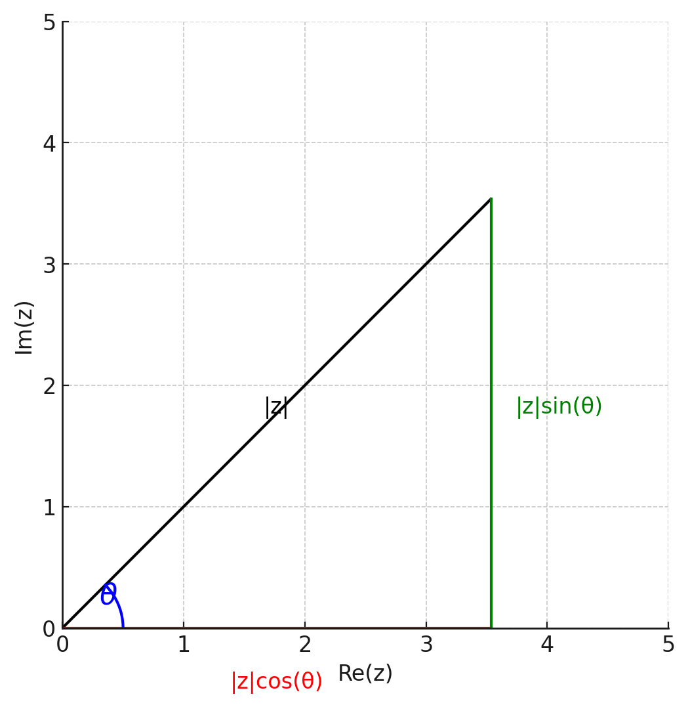

# Numeri Complessi

I numeri complessi sono una estensione dei **numeri reali**.

## Definizione di Campo Complesso

In matematica i numeri complessi formano un **campo**. 

Prendiamo una **coppia ordinata** di numeri reali $(a, b)$, si definiscono le operazioni di **somma** e **prodotto** come segue

$$
(a, b) + (c, d) = (a + c, b + d)
$$

$$
(a, b) \cdot (c, d) = (ac - bd, ad + bc)
$$

Queste due operazioni definiscono un **campo**, che chiamiamo **Campo Complesso** e che indichiamo con $\mathbb{C}$.

> Indichiamo con $\mathbb{R}^2$ oppure $\mathbb{R} \times \mathbb{R}$ l'insieme delle coppie ordinate $(a, b)$ di numeri reali.

::: tip Proprietà
Questa somma e prodotto soddisfano le seguenti proprietà:

Proprietà Commutativa

$$
(a, b) + (c, d) = (c, d) + (a, b)
$$

Proprietà Associativa

$$
(a, b) + \left[ (c, d) + (e, f) \right] = \left[ (a, b) + (c, d) \right] + (e, f)
$$

Proprietà Distributiva

$$
(a, b) \cdot \left[ (c, d) + (e, f) \right] = (a, b) \cdot (c, d) + (a, b) \cdot (e, f)
$$

Notiamo che $(0, 0)$ è l'elemento neutro rispetto alla somma.

$$
(a, b) + (0, 0) = (a, b)
$$

Notiamo che $(1, 0)$ è l'elemento neutro rispetto al prodotto.

$$
(a, b) \cdot (1, 0) = (a, b)
$$

E che

$$
(a, b) + (-a, -b) = (0, 0)
$$

Quindi $(-a, -b)$ è l'opposto di $(a, b)$ rispetto alla somma.
:::

Osserviamo ora che $\mathbb{C}$ contiene il sottoinsieme $\mathbb{C}_0$ delle coppie ordinate $(a, 0)$, con $a \in \mathbb{R}$, ovvero

$$
\mathbb{C}_0 = \{ (a, 0) \mid a \in \mathbb{R} \}
$$

Si dice che $\mathbb{C}_0$ è un **sotto campo** di $\mathbb{C}$ poichè somma e prodotto di coppie ordinate di questo tipo restano in $\mathbb{C}_0$.

Infatti

$$
(a, 0) + (b, 0) = (a + b, 0)
$$

$$
(a, 0) \cdot (b, 0) = (ab, 0)
$$

## Identificazione con i Numeri Reali

Ora preoccupiamoci di stabilire una **corrispondenza biunivoca** tra i due insiemi $\mathbb{R}$ e $\mathbb{C}_0$, operazione che chiamiamo **identificazione**.

Possiamo **identificare** $\mathbb{R}$ con $\mathbb{C}_0$ in modo che

$$
(a, 0) \leftrightarrow a
$$

Ovvero possiamo identificare un **numero reale** $a$ con un **numero complesso** del tipo $(a, 0)$.

## Unità Immaginaria

Vale la pena notare che la coppia $(0, 1)$ gioca un ruolo speciale in $\mathbb{C}$.

Se proviamo a calcolare il quadrato di $(0, 1)$ otteniamo

$$
(0, 1) \cdot (0, 1) = (0 \cdot 0 - 1 \cdot 1, 0 \cdot 1 + 1 \cdot 0) = (-1, 0)
$$

Il quadrato di questo particolare numero coincide con il numero **reale** $-1$.

Viene chiamato **unità immaginaria** e viene indicato con la lettera $i$.

## Forma Algebrica

La forma algebrica si ottiene dalla seguente intuizione:

$$
(a, 0) \leftrightarrow a \text{ quindi } (a, 0) = a
$$

Così come

$$
(b, 0) \leftrightarrow b \text{ quindi } (b, 0) = b
$$

Quindi

$$
(a, b) = (a, 0) + (0, 1) \cdot (b, 0) = a + bi
$$

Questa scrittura è chiamata **forma algebrica** di un numero complesso

$$
z = a + bi
$$

- $a$ è la parte reale di $z$ e si indica con $\Re(z) \text{ oppure } Re(z)$
- $b$ è la parte immaginaria di $z$ e si indica con $\Im(z) \text{ oppure } Im(z)$
- $i$ è l'unità immaginaria

## Somma e Prodotto

Con questa notazione, svolgendo i calcoli si trovano le sopra elencate proprietà della **somma** e del **prodotto**.

$$
(a + bi) + (c + di) = (a + c) + (b + d)i
$$

$$
(a + bi) \cdot (c + di) = (ac - bd) + (ad + bc)i
$$

## Piano Complesso

Cerchiamo di dare una rappresentazione geometrica dei **numeri complessi**.

In un **piano cartesiano** consideriamo 

- l'asse delle **ascisse** come l'asse **reale** 
- l'asse delle **ordinate** come l'asse **immaginario**.

Un **numero complesso** può essere visto come un punto sul piano cartesiano, che in questo caso è chiamato **Piano di Gauss**.

::: tip
- I numeri sull'**asse reale** sono quelli della forma $(a, 0)$, ovvero i numeri reali.
- I numeri sull'**asse immaginario** sono quelli della forma $(0, b)$, ovvero i numeri puramente immaginari.
:::

## Coniugato

Il **coniugato** di un numero complesso $z = a + bi$ è definito come

$$
\overline{z} = a - bi
$$

Vale la pena notare che 

$$
z + \overline{z} = a + bi + a - bi = 2a = 2 \Re(z)
$$

$$
z - \overline{z} = a + bi - a + bi = 2bi = 2 \Im(z)
$$

Inoltre il coniugato della somma è uguale alla somma dei coniugati

$$
\overline{z + w} = \overline{z} + \overline{w}
$$

E il prodotto del coniugato è uguale al coniugato del prodotto

$$
\overline{z \cdot w} = \overline{z} \cdot \overline{w}
$$

## Modulo

Si definisce **modulo** di un numero complesso $z = a + bi$ il numero reale

$$
|z| = \sqrt{a^2 + b^2}
$$

::: tip

Se $z = a$ è un numero reale, allora il modulo si chiama **valore assoluto** e si indica con $|a|$.
:::

E' facile notare che il prodotto tra un **numero complesso** e il suo **coniugato** è uguale al quadrato del **modulo**

$$
z \cdot \overline{z} = (a + bi)(a - bi) = a^2 + b^2 > 0
$$

Geometricamente parlando, il **modulo** rappresenta la distanza tra il punto che rappresenta il numero complesso e l'origine del piano complesso.

## Disuguaglianza Triangolare

La **disuguaglianza triangolare** afferma che per due numeri complessi $z$ e $w$ vale

$$
|z_1 + z_2| \leq |z_1| + |z_2|
$$

## Forma Trigonometrica

Un numero complesso $z = a + bi$ può essere scritto in **forma trigonometrica** come

$$
z = r(\cos \theta + i \sin \theta)
$$

Abbiamo detto che il **modulo** di un numero complesso rappresenta la **distanza** tra il punto e l'origine del piano complesso.

Date le note **formule trigonometriche**

- cateto verde = $|z| \sin \theta$
- cateto rosso = $|z| \cos \theta$

Se ragionassimo in **Coordinate Polari** 

- il $|z|$ coinciderebbe con il **raggio polare** $r$ 
- $\theta$ con l'**angolo polare**.

::: tip Angolo Polare
L'**angolo polare** è l'angolo che il **raggio polare** forma con l'asse delle ascisse positive misurato in senso **antiorario**.
:::

Ora possiamo dire che una coppia $(r, \theta)$ rappresenta un e un solo punto nel piano complesso. Il viceversa non è vero, infatti un punto del piano può essere rappresentato da infinite coppie $(r, \theta)$. Infatti in questo caso, l'angolo $\theta$ è determinato solo a meno di multipli di $2\pi$.

Chiamiamo **argomento** di $z$ indicato con $\arg(z)$ uno qualsiasi degli angoli che determinano $z$ nel piano.

Ora possiamo definire le relazioni tra la **forma algebrica** e la **forma trigonometrica** di un numero complesso come segue

$$
a = r \cos \theta
$$

$$
b = r \sin \theta
$$

Da cui deriva la ben nota forma trigonometrica dei numeri complessi

$$
z = r(\cos \theta + i \sin \theta)
$$

::: tip Relazioni Inverse
Le relazioni inverse sono

$$
r = |z| = \sqrt{a^2 + b^2}
$$

$$
\cos \theta = \frac{a}{\sqrt{a^2 + b^2}}
$$

$$
\sin \theta = \frac{b}{\sqrt{a^2 + b^2}}
$$
:::