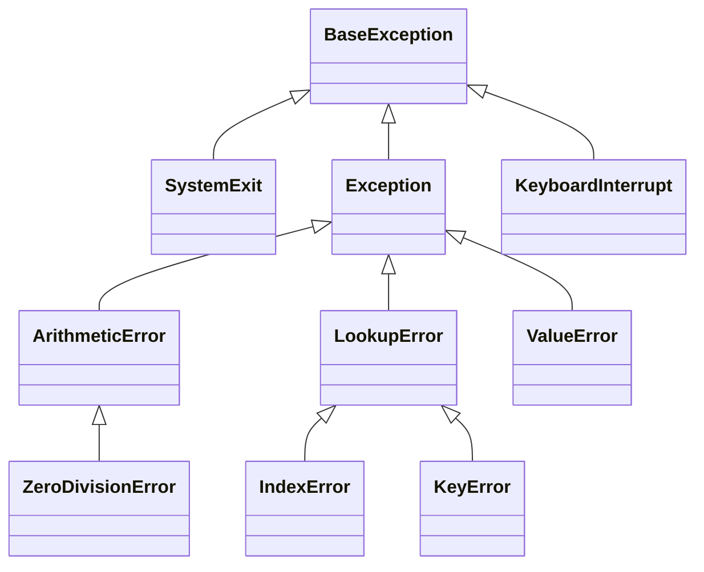
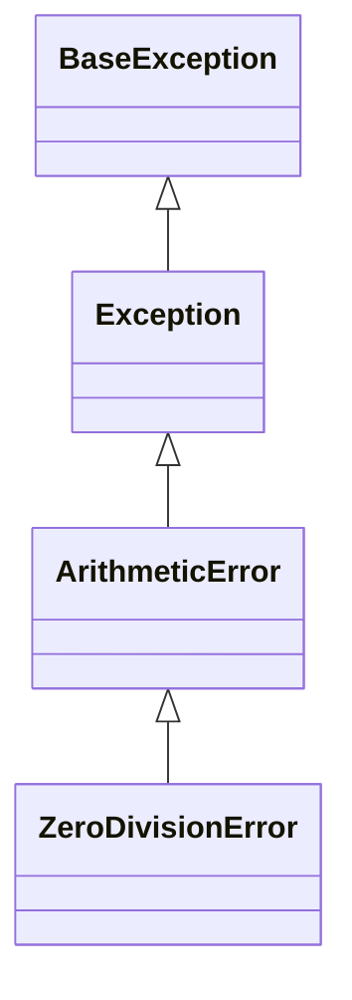

# BaseException

Python fornisce una gerarchia di classi per la gestione delle eccezioni. La classe base di tutte le eccezioni è `BaseException`. 

Questa classe è la superclasse di tutte le altre classi di eccezioni in Python.

Le eccezioni prossime alla radice (cioè quelle che ereditano direttamente da `BaseException`) sono più astratte (generali).

Man mano che ci si sposta verso il basso diventano sempre più concrete e specifiche.

## Albero delle Eccezioni



Vale la pena menzionarne alcune...

### Exception

`Exception` è la classe base per tutte le eccezioni che non sono errori di sistema o di interruzione.

Rappresenta la superclasse della maggior parte delle eccezioni standard di Python.

#### ArithmeticError

`ArithmeticError` è la superclasse di tutte le eccezioni che si verificano durante operazioni aritmetiche.

##### ZeroDivisionError

`ZeroDivisionError` viene sollevata quando si tenta di dividere un numero per zero.

#### ValueError

`ValueError` viene sollevata quando una funzione riceve un argomento del tipo corretto ma con un valore non valido, come quando si cerca di convertire una stringa in un numero e la stringa non contiene un numero valido.

#### TypeError

`TypeError` viene sollevata quando un'operazione o una funzione è applicata a un oggetto di un tipo non appropriato, come cercare di sommare una stringa a un numero.

#### IndexError

`IndexError` viene sollevata quando si tenta di accedere a un indice che non esiste in una sequenza, come una lista o una stringa.

#### KeyError

`KeyError` viene sollevata quando si tenta di accedere a una chiave che non esiste in un dizionario.

#### FileNotFoundError

`FileNotFoundError` viene sollevata quando si tenta di aprire un file che non esiste o che non può essere trovato nel percorso specificato.

#### OSError

`OSError` è una classe base per eccezioni causate da errori di sistema operativi, come la gestione dei file o la manipolazione delle risorse del sistema. Include eccezioni come `FileNotFoundError`, `PermissionError` e `TimeoutError`.

##### PermissionError

`PermissionError` viene sollevata quando non si hanno i permessi necessari per accedere a una risorsa, come cercare di leggere o scrivere un file protetto.

#### TimeoutError

`TimeoutError` viene sollevata quando un'operazione di sistema o di rete scade a causa di un timeout.

### SystemExit

`SystemExit` è sollevata quando Python è pronto a uscire.

::: tip "Approfondimento"

`SystemExit` è sollevata quando si chiama la funzione `sys.exit()`. Se non viene gestita, Python terminerà l'esecuzione del programma.

:::

Notare che non deriva da `Exception` bensì da `BaseException`.

### KeyboardInterrupt

`KeyboardInterrupt` è sollevata quando l'utente preme `Ctrl+C` durante l'esecuzione di un programma.

Notare che non deriva da `Exception` bensì da `BaseException`.

### MemoryError

`MemoryError` viene sollevata quando Python non è in grado di allocare memoria sufficiente per completare un'operazione.

## ImportError

`ImportError` viene sollevata quando un modulo non può essere importato, solitamente perché non è stato trovato o perché contiene errori.

##### ModuleNotFoundError

`ModuleNotFoundError` è una sottoclasse di `ImportError` ed è sollevata quando un modulo specifico non può essere trovato.

### RecursionError

`RecursionError` viene sollevata quando il livello massimo di ricorsione è superato. Questo accade se una funzione si richiama troppo profondamente senza mai terminare.

## Esempio

Riprendiamo gli esempi sul blocco `try-except`.

Notiamo che l'eccezione `ZeroDivisionError` è sottoclasse di `ArithmeticError`, che a sua volta è sotto classe di `Exception`, che a sua volta è sotto classe di `BaseException`.



Detto ciò, nulla vieta di gestire l'eccezione `ZeroDivisionError` con `ArithmeticError` o `Exception`.

```python
try:
    numero = int(input("Inserisci un numero: "))
    divisore = int(input("Inserisci il divisore: "))
    risultato = numero / divisore

except ZeroDivisionError:
    print("Errore: divisione per zero.")
except ArithmeticError:
    print("Errore aritmetico.")
except Exception:
    print("Errore generico.")
```

L'unica cosa da tenere a mente è che l'ordine delle eccezioni è importante. Python esegue il blocco `except` in ordine e si ferma al primo che corrisponde all'eccezione sollevata.

Se invertissimo l'ordine di `ZeroDivisionError` e `ArithmeticError`, l'eccezione `ZeroDivisionError` non verrebbe mai catturata.

::: tip
In questo caso si dice che `ZeroDivisionError` viene **oscurata** da `ArithmeticError`. Non bisogna mai inserire prima eccezione generale e poi eccezione specifica, anche se questo non comporta errori di sintassi. Renderà semplicemente inutile la gestione dell'eccezione più specifica poichè non verrà mai eseguita.

Un editor di codice moderno come Visual Studio Code può segnalare questo tipo di errore.
:::

## Propagazione delle Eccezioni

Le eccezioni possono essere propagate da una funzione a un'altra. 

Immaginiamo una funzione `funzione1` che chiama una funzione `funzione2`. Se `funzione2` solleva un'eccezione, questa può essere propagata a `funzione1`.

```python
def funzione1():
    try:
        funzione2()
    except ZeroDivisionError:
        print("Errore: divisione per zero.")

def funzione2():
    numero = int(input("Inserisci un numero: "))
    divisore = int(input("Inserisci il divisore: "))
    risultato = numero / divisore

funzione1()
```

Se `funzione2` solleva un'eccezione, questa verrà propagata a `funzione1` e gestita lì.

::: note
Più in generale, se un'eccezione non viene gestita in una funzione, viene propagata lungo tutta la catena di chiamate fino a raggiungere il blocco `try-except` che la gestirà, se esiste.
:::

Un altro caso interessante è quando si desidera gestire un'eccezione in un blocco `try-except` e infine propagarla ugualmente al chiamante.

```python
def funzione1():
    try:
        funzione2()
    except ZeroDivisionError:
        print("La funzione2 ha sollevato un'eccezione.")


def funzione2():
    try:
        numero = int(input("Inserisci un numero: "))
        divisore = int(input("Inserisci il divisore: "))
        risultato = numero / divisore
    except ZeroDivisionError:
        print("Errore: divisione per zero.")
        raise

funzione1()
```

In questo caso, se `funzione2` solleva un'eccezione, la gestisce e la propaga a `funzione1`, che a sua volta la gestisce.

Vediamo nel dettaglio come funziona la keyword `raise`:

## Istruzione raise

L'istruzione `raise` solleva l'eccezione specificata, come se fosse stata sollevata normalmente dal programma.

```python
try:

    numero = int(input("Inserisci un numero: "))

    if numero < 0:
        raise ValueError

except ValueError:
    print(f"Errore: il numero non è valido.")
```

Questa istruzione è utile in alemeno due scenari:

1. Simulazione di un'eccezione per testare la gestione delle eccezioni.
2. Propagare un'eccezione al chiamante, per gestire parzialmente l'eccezione in una funzione e completarne la gestione in un'altra.

La keywork `raise` può essere utilizzata anche senza argomenti in un contesto ben specifico.

```python
try:
    # Codice che potrebbe sollevare un'eccezione
except ArithmeticError:
    print("Errore generico.")
    raise
```

In questo caso, `raise` solleva nuovamente l'eccezione che è stata catturata nel blocco `except`, ovvero `ArithmeticError`.

## Istruzione assert

L'istruzione `assert` solleva un'eccezione `AssertionError`.

Viene utilizzata per verificare che una certa condizione sia vera e, se non lo è, solleva un'eccezione.

```python
try:
    numero = 10

    assert numero > 20, "Il numero deve essere maggiore di zero."

except AssertionError:
    print("Errore: il numero non è valido.")
```

In questo caso, l'istruzione `assert` verifica che `numero` sia maggiore di 20. Se non lo è, solleva un'eccezione `AssertionError` con il messaggio specificato.

::: tip "assert vs raise"
L'istruzione `assert` è simile all'istruzione `raise`, ma è più specifica e viene utilizzata per verificare condizioni che dovrebbero essere sempre vere.
:::

Come puoi notare, è possibile passare un messaggio come secondo argomento all'istruzione `assert`. Questo messaggio verrà visualizzato se l'assertion fallisce.

::: warning
Gli `assert` possono essere disabilitati impostando la variabile d'ambiente `PYTHONOPTIMIZE` su un valore diverso da zero. In questo caso, gli `assert` non verranno eseguiti.
:::