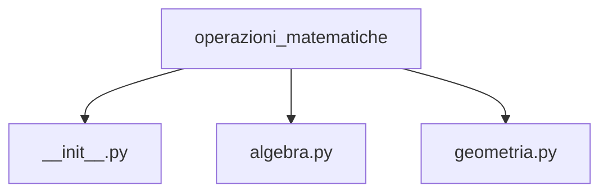

# Package

<ImageComponent 
  src="/CodeInMind/package.png" 
  alt="Description of the image" 
  :width="200" 
/>

Man mano che il tuo progetto cresce, potresti trovarti con molti moduli. Questo potrebbe causare un po' di confusione. 

Così come raggruppiamo le funzioni all'interno di moduli, prima o poi avrai bisogno di **raggruppare i moduli stessi**.

## Contenitori per moduli

Nel mondo dei moduli, un **package** gioca lo stesso ruolo che una cartella o directory ha nel mondo dei file.

Un **package** è un insieme di moduli raggruppati in una struttura gerarchica. Ti permette di organizzare meglio il tuo codice, soprattutto quando lavori su progetti di grandi dimensioni o con molti moduli. 

In pratica, un package è una cartella che contiene uno o più moduli, con l'aggiunta di un file speciale chiamato `__init__.py`.


## Creazione di un Package

Creare un **package** in Python è molto semplice. Segui questi passi:

1. **Crea una cartella** che rappresenta il tuo package.
2. All'interno della cartella, **inserisci i tuoi moduli** (file `.py`).
3. Aggiungi un file vuoto chiamato **`__init__.py`** all'interno della cartella. Questo file indica a Python che la cartella deve essere trattata come un package.

Ad esempio:

```
mio_package/
init.py
modulo1.py
modulo2.py
```

In questo caso, `mio_package` è il package che contiene i moduli `modulo1.py` e `modulo2.py`. Ora puoi importare questi moduli all'interno del tuo codice come segue:

```python
from mio_package import modulo1
from mio_package import modulo2
```

## Esempio

Supponiamo di voler creare un package per gestire operazioni matematiche. Creiamo una cartella chiamata `operazioni_matematiche` con la seguente struttura:



Il file `algebra.py` potrebbe contenere funzioni per operazioni algebriche, mentre `geometria.py` funzioni per operazioni geometriche. 

Ecco come importare e utilizzare queste funzioni:

```python
from operazioni_matematiche.algebra import somma
from operazioni_matematiche.geometria import area_cerchio

somma(3, 4)
area_cerchio(5)
```