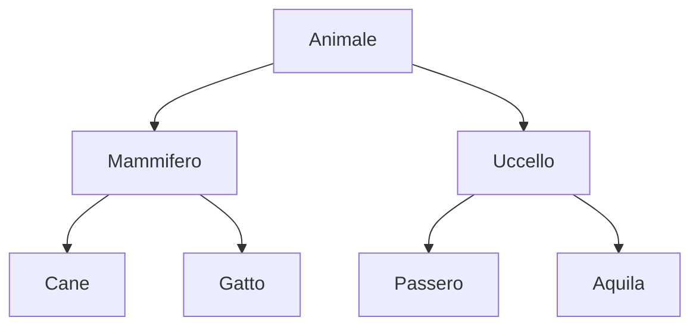

# Programmazione Orientata Agli Oggetti

La programmazione orientata agli oggetti (OOP) è un paradigma di programmazione che utilizza "oggetti" per progettare applicazioni e scrivere codice. 

Gli **oggetti** sono **entità** che contengono dati e metodi che operano su questi dati.

## OOP vs Programmazione Procedurale

In programmazione procedurale, il codice è organizzato in funzioni e procedure che operano su dati. In OOP, il codice è organizzato in oggetti che contengono dati e metodi.

Nell'approccio procedurale, è possibile distinguere tra

- mondo dei dati (variabili)
- mondo delle funzioni (procedure)

L'approccio orientato agli oggetti invece permette di raggruppare dati e funzioni in un'unica entità, divisi in **classi**.

## Classi

Una **classe** è un modello che definisce le variabili e i metodi che un oggetto può avere. Un **oggetto** è un'**istanza** di una classe.

```python
class MyClass:
    x = 5

obj = MyClass()
print(obj.x) # Output: 5
```

Ogni oggetto ha delle caratteristiche dette **attributi** e dei comportamenti detti **metodi**.

Possiamo vedere le classi come dei **modelli** che definiscono come gli oggetti devono essere creati e come devono comportarsi. E' anche possibile modificare il comportamento di una classe esistente tramite l'ereditarietà. Ovvero creando una nuova classe che eredita i metodi e gli attributi di una classe esistente, e aggiungendo nuovi metodi e attributi.

## Oggetti

Gli oggetti sono incarnazioni di una classe.

Nell'esempio precedente, `obj` è un'istanza della classe `MyClass`. Esso eredita tutti gli attributi e i metodi della classe `MyClass`.

Quindi possiamo affermare che un oggetto contiene le caratteristiche di una classe. In particolare, un oggetto appartiene a una classe e a tutte le classi superclassi da cui essa deriva.

Al contrario, un oggetto appartenente a una superclasse potrebbe non appartenere a nessuna delle sue sottoclassi.

### Caratteristiche

Un oggetto ha tre caratteristiche principali:

- **Stato**: rappresenta i dati (attributi) di un oggetto. Ogni oggetto ha un proprio stato, che lo rende unico e originale.
- **Comportamento**: rappresenta i metodi di un oggetto. Ogni oggetto può eseguire azioni specifiche, anche verso altri oggetti.
- **Identità**: ogni oggetto ha un'identità univoca, che lo distingue da tutti gli altri oggetti.

```python
class Dog:
    def __init__(self, name):
        self.name = name

    def bark(self):
        print(f"{self.name} is barking")

dog1 = Dog("Fido")
dog2 = Dog("Buddy")

dog1.bark() # Output: Fido is barking
dog2.bark() # Output: Buddy is barking
```


## Ereditarietà

La **ereditarietà** è un concetto chiave della programmazione orientata agli oggetti. Consente di creare una nuova classe che eredita i metodi e gli attributi di una classe esistente.

Pensiamo ad esempio ad una classe `Animal`. Essa è in grado di descriverere le caratteristiche di un animale generico. Da qui si evince che una classe è logicamente simile al concetto di categoria.

Se volessimo essere più specifici, potremmo creare una classe `Dog` che eredita dalla classe `Animal`. In questo modo, la classe `Dog` eredita tutti gli attributi e i metodi della classe `Animal`, e aggiunge nuovi attributi e metodi specifici per i cani.

In questo caso si dice che:

- `Animal` è la **classe base** o **superclasse** per la classe `Dog`
- `Dog` è la **classe derivata** o **sottoclasse** di `Animal`

```python
class Animal:
    def __init__(self, name):
        self.name = name

    def eat(self):
        print(f"{self.name} is eating")

class Dog(Animal):
    def bark(self):
        print(f"{self.name} is barking")


dog = Dog("Fido")
dog.eat()  # Output: Fido is eating
dog.bark() # Output: Fido is barking
```

Ogni sottoclasse si dice che è più **specializzata** o **specifica** della sua superclasse. Al contrario, ogni **superclasse** è più **generale** o più **astratta** delle sue sottoclassi.

::: tip Gerarchia

In OOP, le classi possono essere organizzate in una gerarchia. La classe base è la classe più generale, mentre le classi derivate sono più specifiche.

La gerarchia cresce sempre dall'alto verso il basso.


:::

## Incapsulamento

L'**incapsulamento** è un altro concetto chiave della programmazione orientata agli oggetti. Consente di nascondere i dettagli di implementazione di un oggetto e di esporre solo i metodi pubblici. Come potete immaginare, la capacità di nascondere e proteggere i dati da accessi non autorizzati è un aspetto fondamentale della programmazione.

In Python, l'**incapsulamento** è implementato utilizzando i seguenti metodi:

- **Public**: gli attributi e i metodi pubblici possono essere accessibili da qualsiasi parte del programma.
- **Protected**: gli attributi e i metodi protetti possono essere accessibili solo all'interno della classe stessa e delle sue sottoclassi.

Vedremo più avanti come implementare l'**incapsulamento** in Python.
