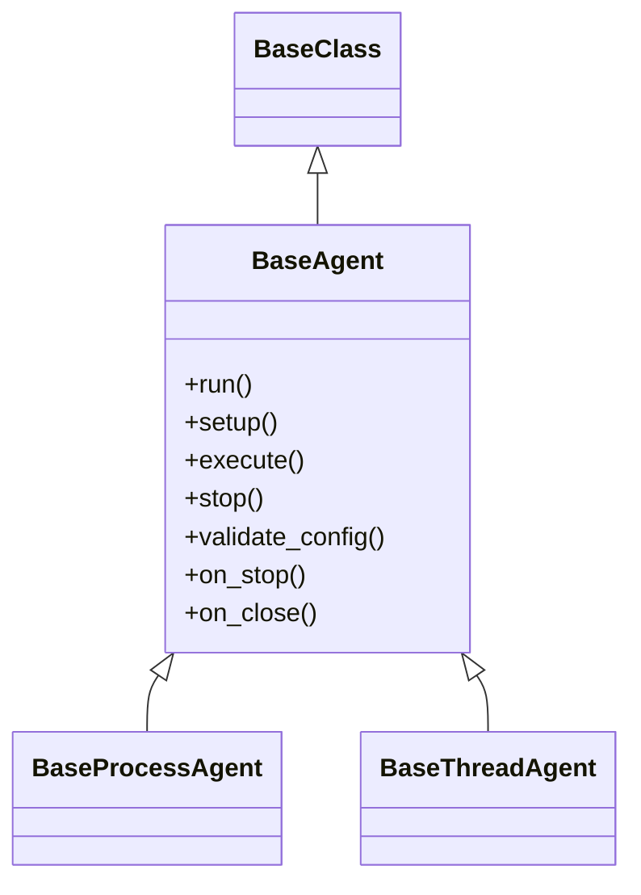
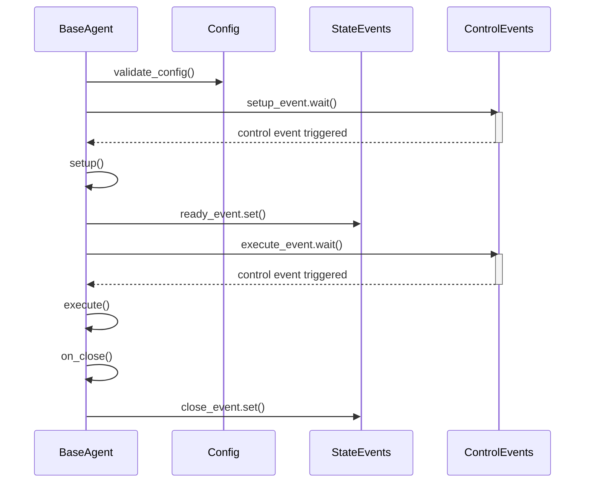
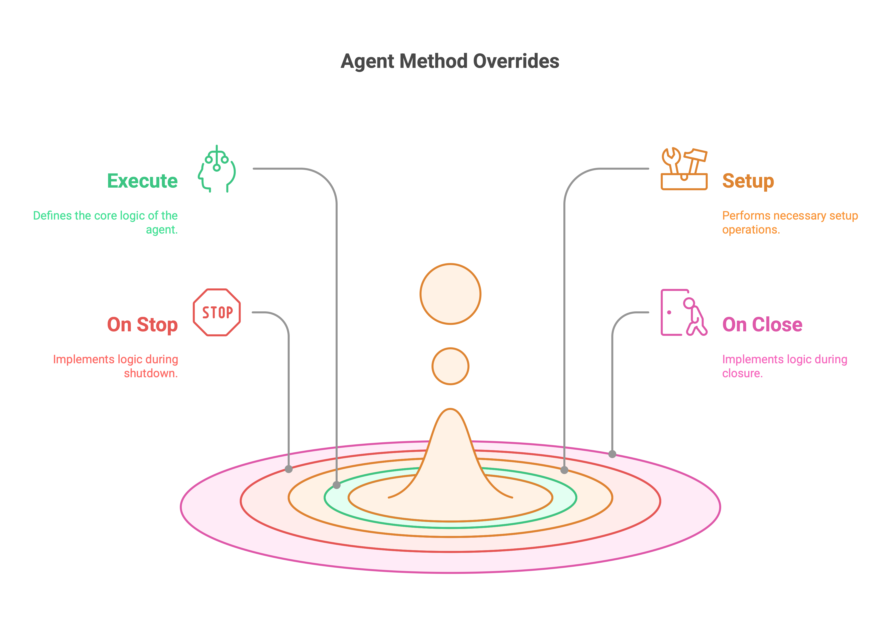
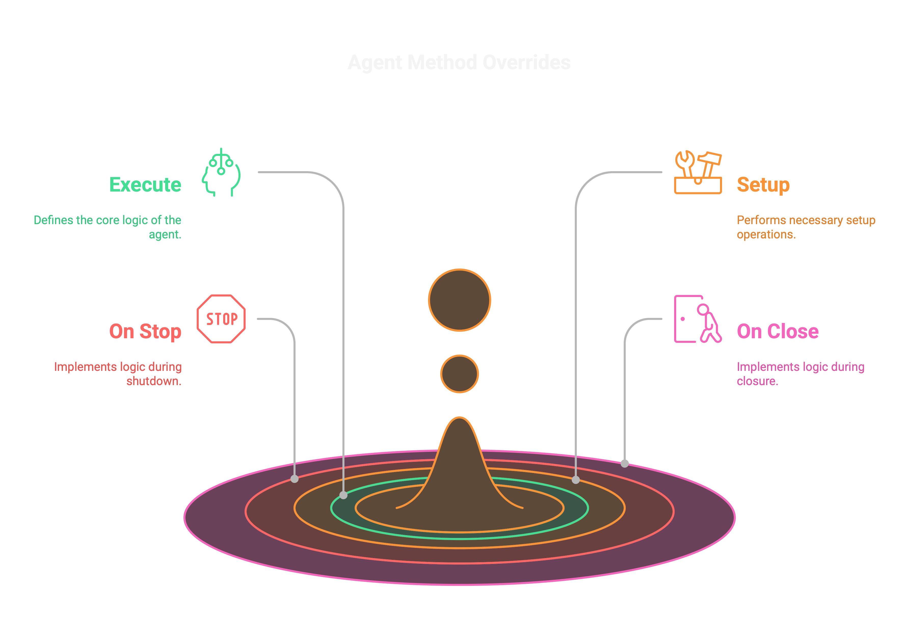
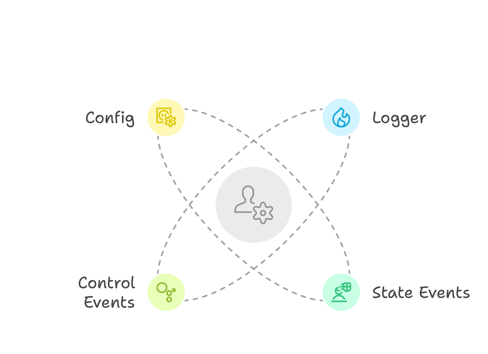
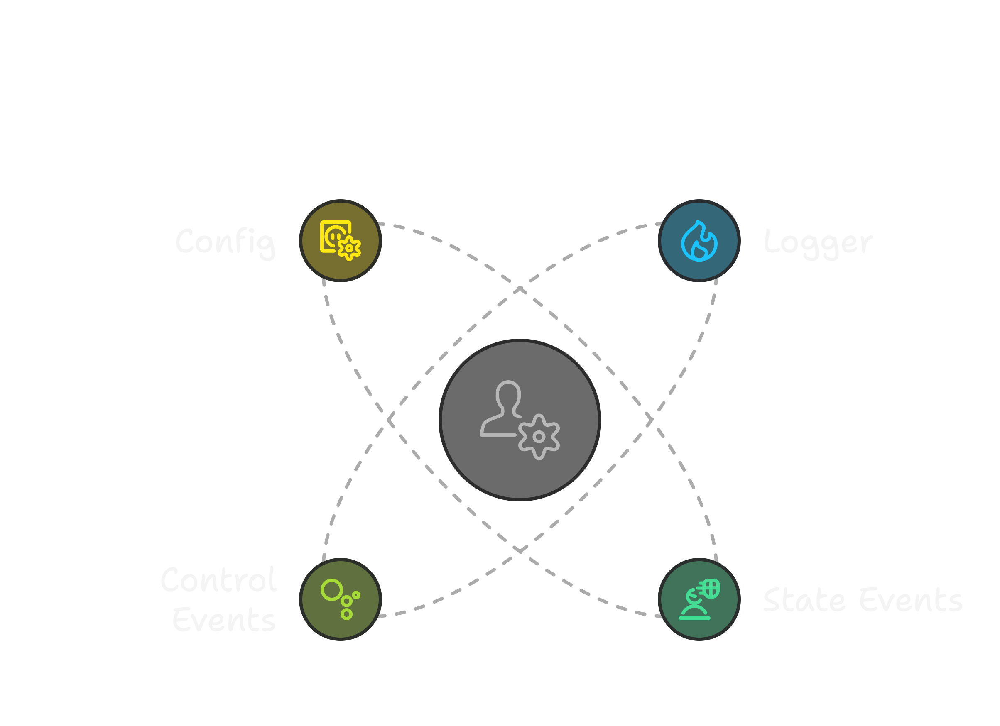

# BaseAgent

The **BaseAgent** is the foundation of all other agents in PyOrchestrate. It provides the basic structure for any custom agent. Use it as a starting point to create your own agents with completely custom behavior.

## Inheritance

The `BaseProcessAgent` and `BaseThreadAgent` classes inherit from the `BaseAgent` class.

This is the shared structure of both classes.



To learn more about `BaseClass` click here.

## Sequence Diagram

The sequence diagram below illustrates the lifecycle of the `BaseAgent` after it is started.



## Usage

You can create a custom agent by inheriting from the `BaseProcessAgent` or `BaseThreadAgent` class.

| Method | Description | Override |
|--------|-------------| ---------|
| [execute](#execute) | Define the core logic of the agent. | Required :green_circle: |
| [setup](#setup) | Perform any setup operations required by the agent. | Optional :orange_circle: |
| [stop](#stop) | Stop the agent. | Prohibited :red_circle: |
| [validate_config](#validate_config) | Validate the agent's configuration. | Optional :orange_circle: |
| [on_stop](#on-stop) | Implement custom logic during external shutdown request. | Optional :orange_circle: |
| [on_close](#on-close) | Implement custom logic during the agent’s shutdown. | Optional :orange_circle: |

{.light-only}
{.dark-only}

::: tip Important
Make sure to call the parent method **for each overridden** method.

```python{3}
class CustomAgent(BaseAgent):
    def setup(self):
        super().setup()
        # Custom setup logic
```
:::

## Configuration

The `BaseAgent` class defines its own configuration object via the `Config` class.

Click [here](/learn/agents/index#configuration) to learn more about configuration objects.


## Use Case

When no predefined agent meets your requirements, the `BaseAgent` is ideal for implementing custom logic.

## Methods

### run

```python
@final
```

This is the entry point for all agents, encapsulating their entire lifecycle and handling the low-level execution logic. In essence, the `run()` method in BaseAgent overrides the run method from `threading.Thread` or `multiprocessing.Process`.

It provides [execute](#execute) method to be overridden by the derived class to define the core logic of the agent.

::: warning Do not override
Marked as `@final` to prevent overriding in derived class ensuring that the core logic remains consistent across all agents.
:::

### setup
```python
@template
```

This method is called before the agent starts running. It can be overridden to perform any setup operations required by the agent.

::: tip Control Events
The setup method waits for the `control_events.setup_event` to be triggered, giving external systems the ability to manage when the setup phase starts.
:::

::: tip
Be sure to call the parent method if you override it.
:::

### execute

```python
@abstractmethod
```

This method is called by the `run()` method to execute the core logic of the agent. It must be overridden by the derived class to define the agent's behavior.

::: tip
Be sure to call the parent method.
:::

### stop

```python
@final
```

This method is called to stop the agent from external systems. 

Keep in mind that agents will not stop immediately. They will complete the current iteration of the `execute` method before stopping.

::: warning Do not override
Marked as `@final` to prevent overriding in derived class ensuring that the core logic remains consistent across all agents.
:::

::: tip
To implement custom logic during the agent’s shutdown, override the [on_stop](#on_stop) method in your derived class.
:::

### validate_config

```python
@final
```

This method is called to validate the agent's configuration.

::: warning Do not override
Marked as `@final` to prevent overriding in derived class ensuring that the core logic remains consistent across all agents.
:::

::: tip
To implement custom validation logic, override `validate` method of your `Config` class.
:::

### on_stop

```python
@optional
```

This method is called when the agent is stopped. It can be overridden to implement custom logic during the agent’s shutdown.

### on_close

```python
@optional
```

This method is called when the agent is closed. It can be overridden to implement custom logic during the agent’s shutdown.

## Attributes

{.light-only}
{.dark-only}

### Logger

```python
logger: Logger
```

The logger object for the agent. Available levels are `DEBUG`, `INFO`, `SUCCESS`, `WARNING`, `ERROR`, and `CRITICAL`.

### State Events

```python
state_events: BaseAgent.StateEvents
```

The state events object for the agent.

| Attribute | Description |
|-----------|-------------|
| ready_event | Event to signal that the agent is ready to start. |
| close_event | Event to signal that the agent is closing. |

To learn more about state events, click [here](../index.md#stateevents).

### Control Events

```python
control_events: BaseAgent.ControlEvents
```

The control events object for the agent.

| Attribute | Description |
|-----------|-------------|
| setup_event | Event to trigger the setup phase. |
| execute_event | Event to trigger the execution phase. |
| stop_event | Event to trigger the stop phase. |

To learn more about control events, click [here](../index.md#controlevents).

### Config

```python
config: BaseAgent.Config
```

The configuration object for the agent.

| Attribute | Default | Description |
|-----------|---------|-------------|
| logger_config | `LoggerConfig` | Defines configuration for the logger. |

To learn more about the configuration object, click [here](../index.md#configuration).

## Example

In this example, we create a custom agent that monitors a log file for a specific keyword.


```python
from PyOrchestrate.core.agent import BaseProcessAgent

class LogMonitorAgent(BaseProcessAgent["LogMonitorAgent.Config"]):
    class Config(BaseProcessAgent.Config):
        log_file: str = "application.log"
        keyword: str = "ERROR"

    def setup(self):
        """
        Ensure the log file exists.
        """
        super().setup()

        self.logger.info(f"Initializing LogMonitorAgent for file: {self.config.log_file}")
        try:
            with open(self.config.log_file, "r") as f:
                self.logger.info("Log file found.")
        except FileNotFoundError:
            self.logger.error(f"Log file {self.config.log_file} does not exist.")
            raise

    def execute(self):
        """
        Monitor the log file for the specified keyword.
        """
        super().execute()

        self.logger.info(f"Monitoring for keyword: '{self.config.keyword}'")
        try:
            with open(self.config.log_file, "r") as f:
                for line in f:
                    if self.config.keyword in line:
                        self.logger.warning(f"Keyword found: {line.strip()}")
        except Exception as e:
            self.logger.error(f"Error reading the log file: {e}")

    def on_stop(self):
        """
        Log the agent's shutdown.
        """
        self.logger.info("LogMonitorAgent stopped.")
```

## Advanced Usage

For a deeper dive into how agents work and their advanced use cases, explore the **Advanced Insights section**.