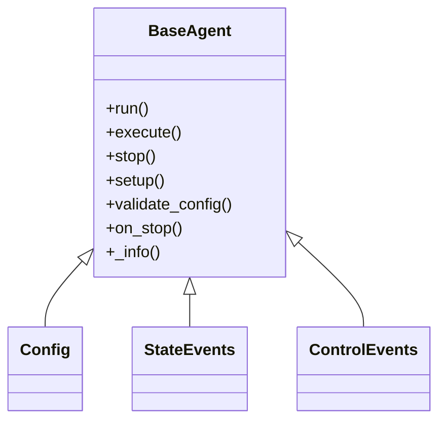

# BaseAgent

The **BaseAgent** is the foundation of all other agents in PyOrchestrate. It provides the basic structure for any custom agent. Use it as a starting point to create your own agents with completely custom behavior.

## Class Diagram

The `BaseAgent` class is defined in the `base_agent.py`.



## Configuration

The `BaseAgent` class defines its own configuration object via the `Config` class.

Click [here](/learn/agents/index#configuration) to learn more about configuration objects.


## Use Case

When no predefined agent meets your requirements, the `BaseAgent` is ideal for implementing custom logic.

## Key Features

### run

```python
@final
```

This is the entry point for all agents, encapsulating their entire lifecycle and handling the low-level execution logic. In essence, the `run()` method in BaseAgent overrides the run method from `threading.Thread` or `multiprocessing.Process`.

It provides [execute](#execute) method to be overridden by the derived class to define the core logic of the agent.

::: warning Do not override
Marked as `@final` to prevent overriding in derived class ensuring that the core logic remains consistent across all agents.
:::

### setup

This method is called before the agent starts running. It can be overridden to perform any setup operations required by the agent.

::: tip Control Events
The setup method waits for the `control_events.setup_event` to be triggered, giving external systems the ability to manage when the setup phase starts.
:::

::: warning Override
Make sure to call the parent method if you override it.
:::

### execute

```python
@abstractmethod
```

This method is called by the `run()` method to execute the core logic of the agent. It must be overridden by the derived class to define the agent's behavior.

### stop

```python
@final
```

This method is called to stop the agent.

::: warning Do not override
Marked as `@final` to prevent overriding in derived class ensuring that the core logic remains consistent across all agents.
:::

::: tip
To implement custom logic during the agent’s shutdown, override the on_stop method in your derived class.
:::

## Inheritance

The `BaseAgent` class is a subclass of `BaseClass`.

Click here to learn more about.

## Advanced Usage

For a deeper dive into how agents work and their advanced use cases, explore the **Advanced Insights section**.