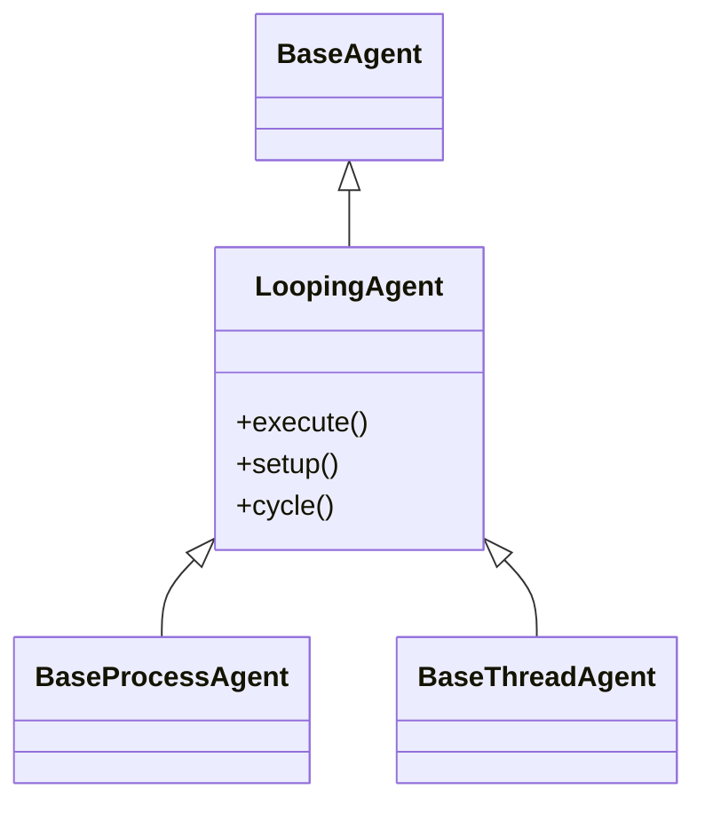
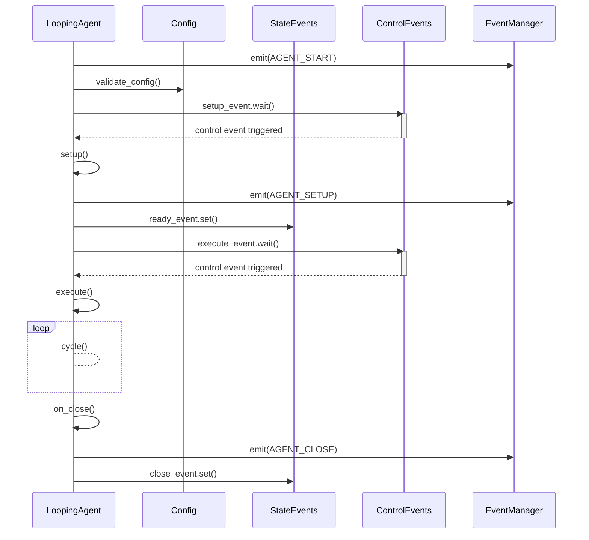

# LoopingAgent

The **LoopingAgent** is basically a `BaseAgent` that loops through its core logic until it is stopped. It is ideal for implementing custom logic that needs to run continuously.

It does not provide any sleep or delay mechanism. The derived class must implement its own delay mechanism to control the frequency of the loop.

## Why use LoopingAgent?

The LoopingAgent is ideal for developers who need an efficient, **thread-safe mechanism** to execute repetitive tasks. Whether running as a process or a thread, it employs appropriate event controls to manage execution reliably. It supports both **finite** and **infinite loops**, and you can always use the `stop` method to halt the agent safely.


## Usage

You can create a custom `LoopingAgent` by inheriting from the `LoopingProcessAgent` or `LoopingThreadAgent` class.

| Method | Description | Override |
|--------|-------------| ---------|
| [cycle](#cycle) | Implement the repeated logic of the agent. | Required :green_circle: |
| [setup](#setup) | Perform any setup operations required by the agent. | Optional :orange_circle: |
| [on_stop](#on-stop) | Implement custom logic during external shutdown request. | Optional :orange_circle: |
| [on_close](#on-close) | Implement custom logic during the agent’s shutdown. | Optional :orange_circle: |

::: tip Important
Make sure to call the parent method **for each overridden** method.

```python{3}
class CustomAgent(LoopingProcessAgent):
    def setup(self):
        super().setup()
        # Custom setup logic
```
:::

## Inheritance

The `LoopingProcessAgent` and `LoopingThreadAgent` classes inherit from the `LoopingAgent` class.

This is the shared structure of both classes.



To learn more about `BaseAgent` click [here](baseagent.md).

## Sequence Diagram

The sequence diagram below illustrates the lifecycle of the `LoopingAgent` after it is started.



## Configuration

The `LoopingAgent` class defines its own configuration object via the `Config` class.

| Attribute | Default | Description |
|-----------|---------|-------------|
| logger_config | `LoggerConfig` | Defines configuration for the logger. |
| limit | -1 | The number of times the agent will cycle. A value of -1 means the agent will run indefinitely. |


Click [here](/learn/agents/index#configuration) to learn more about configuration objects.


## Use Case

When you need to create an agent that performs a specific task repeatedly, the `LoopingAgent` is the ideal choice. It provides a structure that allows you to focus on the core logic of the agent.

## Methods

### run

```python
@final
```

This is the entry point for all agents, encapsulating their entire lifecycle and handling the low-level execution logic. In essence, the `run()` method in LoopingAgent overrides the run method from `threading.Thread` or `multiprocessing.Process`.

It provides [execute](#execute) method to be overridden by the derived class to define the core logic of the agent.

::: warning Do not override
Marked as `@final` to prevent overriding in derived class ensuring that the core logic remains consistent across all agents.
:::

### setup
```python
@template
```

This method is called before the agent starts running. It can be overridden to perform any setup operations required by the agent.

::: tip Control Events
The setup method waits for the `control_events.setup_event` to be triggered, giving external systems the ability to manage when the setup phase starts.
:::

::: tip
Be sure to call the parent method if you override it.
:::

### execute

```python
@abstractmethod
```

This method is called by the `run()` method to execute the core logic of the agent. It must be overridden by the derived class to define the agent's behavior.

::: tip
Be sure to call the parent method.
:::

### stop

```python
@final
```

This method is called to stop the agent from external systems. 

Keep in mind that agents will not stop immediately. They will complete the current iteration of the `execute` method before stopping.

::: warning Do not override
Marked as `@final` to prevent overriding in derived class ensuring that the core logic remains consistent across all agents.
:::

::: tip
To implement custom logic during the agent’s shutdown, override the [on_stop](#on_stop) method in your derived class.
:::

### on_stop

```python
@optional
```

This method is called when the agent is stopped. It can be overridden to implement custom logic during the agent’s shutdown.

### on_close

```python
@optional
```

This method is called when the agent is closed. It can be overridden to implement custom logic during the agent’s shutdown.

## Attributes

### Logger

```python
logger: Logger
```

The logger object for the agent. Available levels are `DEBUG`, `INFO`, `SUCCESS`, `WARNING`, `ERROR`, and `CRITICAL`.

### State Events

```python
state_events: LoopingAgent.StateEvents
```

The state events object for the agent.

### Control Events

```python
control_events: LoopingAgent.ControlEvents
```

The control events object for the agent.

### Config

```python
config: LoopingAgent.Config
```

The configuration object for the agent.

## Example

In this example, we create a custom agent that monitors a log file for a specific keyword.


```python
from PyOrchestrate.core.agent import LoopingProcessAgent

class LogMonitorAgent(LoopingProcessAgent):

    def setup(self):
        """
        Ensure the log file exists.
        """
        super().setup()

        self.logger.info(f"Initializing LogMonitorAgent for file: {self.config.log_file}")
        try:
            with open(self.config.log_file, "r") as f:
                self.logger.info("Log file found.")
        except FileNotFoundError:
            self.logger.error(f"Log file {self.config.log_file} does not exist.")
            raise

    def execute(self):
        """
        Monitor the log file for the specified keyword.
        """
        super().execute()

        self.logger.info(f"Monitoring for keyword: '{self.config.keyword}'")
        try:
            with open(self.config.log_file, "r") as f:
                for line in f:
                    if self.config.keyword in line:
                        self.logger.warning(f"Keyword found: {line.strip()}")
        except Exception as e:
            self.logger.error(f"Error reading the log file: {e}")

    def on_stop(self):
        """
        Log the agent's shutdown.
        """
        self.logger.info("LogMonitorAgent stopped.")
```

## Advanced Usage

For a deeper dive into how agents work and their advanced use cases, explore the **Advanced Insights section**.