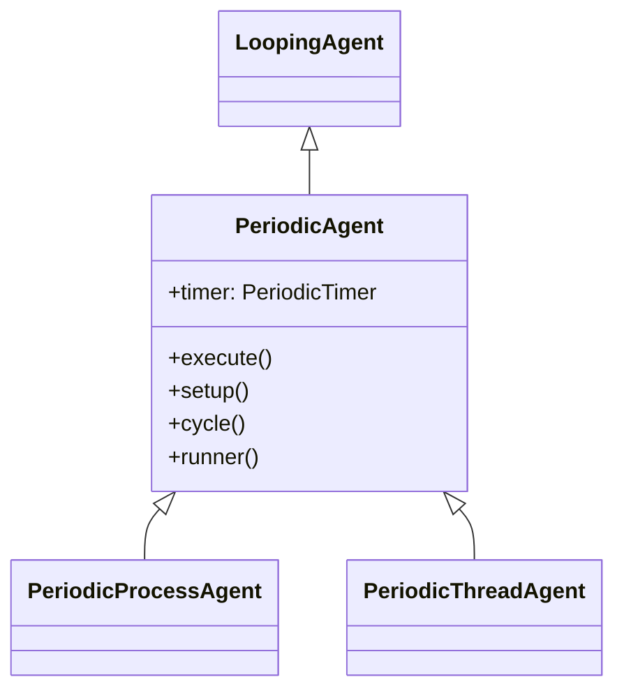
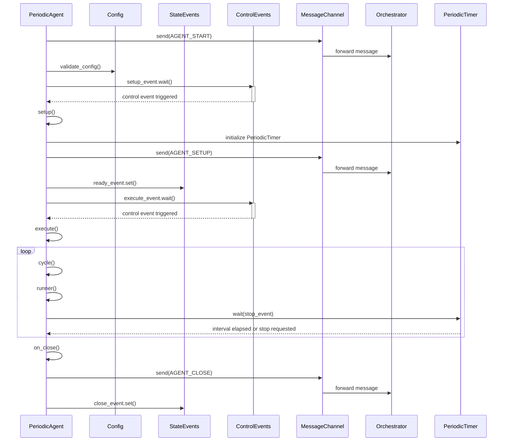

# PeriodicAgent

The **PeriodicAgent** is basically a `LoopingAgent` that executes its core logic at fixed and regular intervals. It is ideal for implementing custom logic that needs to be executed periodically with precise timing.

It provides a built-in timing mechanism that automatically controls the execution frequency, with options for delay compensation.

## Why use PeriodicAgent?

The PeriodicAgent is ideal for developers who need an efficient, **thread-safe mechanism** to execute repetitive tasks at regular intervals. Whether running as a process or a thread, it employs appropriate event controls to manage execution reliably. It supports both **finite** and **infinite loops**, and you can always use the `stop` method to halt the agent safely.

## Usage

You can create a custom `PeriodicAgent` by inheriting from the `PeriodicProcessAgent` or `PeriodicThreadAgent` class.

| Method | Description | Override |
|--------|-------------| ---------|
| [runner](#runner) | Implement the repeated logic of the agent. | Required :green_circle: |
| [setup](#setup) | Perform any setup operations required by the agent. | Optional :orange_circle: |
| [on_stop](#on-stop) | Implement custom logic during external shutdown request. | Optional :orange_circle: |
| [on_close](#on-close) | Implement custom logic during the agent's shutdown. | Optional :orange_circle: |

::: tip Important
Make sure to call the parent method **for each overridden** method.

```python{3}
class CustomAgent(PeriodicProcessAgent):
    def setup(self):
        super().setup()
        # Custom setup logic
```
:::

## Inheritance

The `PeriodicProcessAgent` and `PeriodicThreadAgent` classes inherit from the `PeriodicAgent` class.

This is the shared structure of both classes.



To learn more about `LoopingAgent` click [here](loopingagent.md).

## Sequence Diagram

The sequence diagram below illustrates the lifecycle of the `PeriodicAgent` after it is started.



## Configuration

The `PeriodicAgent` class defines its own configuration object via the `Config` class.

| Attribute | Default | Description |
|-----------|---------|-------------|
| logger_config | `LoggerConfig()` | Defines configuration for the logger. |
| validation_policy | `ValidationPolicy()` | Defines the validation policy. |
| limit | -1 | The number of times the agent will cycle. A value of -1 means the agent will run indefinitely. |
| execution_interval | 1.0 | The interval between two consecutive executions in seconds. |
| delay_compensation | False | Compensate the delay in the execution to maintain precise intervals. |

To learn more about the configuration object, click [here](../index.md#configuration).

## Use Case

When you need to create an agent that performs a specific task repeatedly at regular and precise intervals, the `PeriodicAgent` is the ideal choice. It provides a structure that allows you to focus on the core logic of the agent while automatically handling the timing.

## Methods

### run

```python
@final
```

This is the entry point for all agents, encapsulating their entire lifecycle and handling the low-level execution logic. In essence, the `run()` method in PeriodicAgent overrides the run method from `threading.Thread` or `multiprocessing.Process`.

It provides [execute](#execute) method to be overridden by the derived class to define the core logic of the agent.

::: warning Do not override
Marked as `@final` to prevent overriding in derived class ensuring that the core logic remains consistent across all agents.
:::

### setup
```python
@template
```

This method is called before the agent starts running. It can be overridden to perform any setup operations required by the agent.

::: tip Control Events
The setup method waits for the `control_events.setup_event` to be triggered, giving external systems the ability to manage when the setup phase starts.
:::

::: tip
Be sure to call the parent method if you override it.
:::

### execute

```python
@abstractmethod
```

This method is called by the `run()` method to execute the core logic of the agent. It must be overridden by the derived class to define the agent's behavior.

::: tip
Be sure to call the parent method.
:::

### cycle

```python
@final
```

This method defines the agent's work to be done in each iteration of the loop. It calls the `runner()` method and manages timing through `PeriodicTimer`.

::: warning Do not override
Marked as `@final` to prevent overriding in derived class. Implement the [runner](#runner) method instead.
:::

### runner

```python
@abstractmethod
```

This is the method that must be implemented in derived classes to define the logic that will be executed periodically.

::: tip
This is the only method you MUST implement when creating a custom PeriodicAgent.
:::

### stop

```python
@final
```

This method is called to stop the agent from external systems. 

Keep in mind that agents will not stop immediately. They will complete the current iteration of the `execute` method before stopping.

::: warning Do not override
Marked as `@final` to prevent overriding in derived class ensuring that the core logic remains consistent across all agents.
:::

::: tip
To implement custom logic during the agent's shutdown, override the [on_stop](#on_stop) method in your derived class.
:::

### on_stop

```python
@optional
```

This method is called when the agent is stopped. It can be overridden to implement custom logic during the agent's shutdown.

### on_close

```python
@optional
```

This method is called when the agent is closed. It can be overridden to implement custom logic during the agent's shutdown.

## Attributes

### Logger

```python
logger: Logger
```

The logger object for the agent. Available levels are `DEBUG`, `INFO`, `SUCCESS`, `WARNING`, `ERROR`, and `CRITICAL`.

### State Events

```python
state_events: PeriodicAgent.StateEvents
```

The state events object for the agent.

### Control Events

```python
control_events: PeriodicAgent.ControlEvents
```

The control events object for the agent.

### Config

```python
config: PeriodicAgent.Config
```

The configuration object for the agent.

### Timer

```python
timer: PeriodicTimer
```

The periodic timer object that manages execution intervals and delay compensation.

## Example

In this example, we create a custom agent that periodically monitors the system's CPU usage.

```python
import psutil
from PyOrchestrate.core.agent import PeriodicProcessAgent


class CPUMonitorAgent(PeriodicProcessAgent):

    class Config(PeriodicProcessAgent.Config):
        execution_interval: float = 5.0  # Check every 5 seconds
        delay_compensation: bool = True   # Compensate delays
        cpu_threshold: float = 80.0       # CPU alarm threshold

    config: Config

    def setup(self):
        """
        Initialize CPU monitoring.
        """
        super().setup()
        self.logger.info("CPUMonitorAgent initialized")
        self.logger.info(f"CPU threshold: {self.config.cpu_threshold}%")
        self.logger.info(f"Check interval: {self.config.execution_interval}s")

    def runner(self):
        """
        Monitor CPU usage and generate alarms if necessary.
        """
        try:
            cpu_percent = psutil.cpu_percent(interval=1)
            self.logger.info(f"CPU usage: {cpu_percent}%")
            
            if cpu_percent > self.config.cpu_threshold:
                self.logger.warning(
                    f"High CPU usage detected: {cpu_percent}% "
                    f"(threshold: {self.config.cpu_threshold}%)"
                )
            else:
                self.logger.debug("CPU usage normal")
                
        except Exception as e:
            self.logger.error(f"Error during CPU monitoring: {e}")

    def on_close(self):
        """
        Log the agent's shutdown.
        """
        super().on_close()
        self.logger.info("CPUMonitorAgent stopped.")
```

## Advanced Usage

For a deeper dive into how agents work and their advanced use cases, explore the **Advanced Insights section**.
