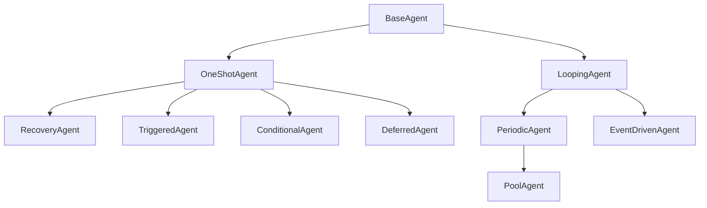
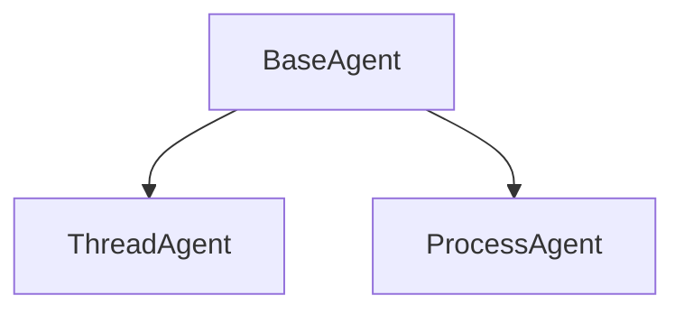

# Agents

In PyOrchestrate, **agents** are the core building blocks. 

Each agent runs as a **process** or a **thread** and acts as a container for your custom logic. Whether you need continuous execution, periodic tasks, or one-shot operations, agents are designed to fit a variety of scenarios and adapt to your workflows.

Before diving into the **built-in agents**, let’s take a moment to understand some core concepts that define how agents work in PyOrchestrate.

## Dual Inheritance: Behavior and Execution Mode

Agents in PyOrchestrate are defined by their **behavior** and their **execution mode**. 

The behavior is determined by a group of hierarchical classes (e.g., OneShotAgent, LoopingAgent), while the execution mode is chosen from a smaller set of classes (ThreadAgent or ProcessAgent). 

All user-defined agent must inherit first from a behavior class and then from an execution mode class.

This means **higher-level agents** come with more built-in functionality but are less customizable, while **lower-level agents** require more work but give you full control. 

::: tip
The challenge is finding the highest-level agent that fits your needs with minimal customization.
:::

By choosing the right agent, you can balance ease of use and flexibility based on your requirements.



The hierarchical structure you see above represents only the **behavior** of an agent. Below you can see available execution-mode class.



For example, if you want to create a looping agent that runs as a process:

```python
class MyAgent(LoopingAgent, ProcessAgent):
    pass
```

## Customizing Agent Behavior

Every agent provides abstract methods that you need to override to define the agent’s behavior. These methods are where you implement the logic that makes your agent unique.

For example, in a `PeriodicAgent`, you override the `runner()` method to specify what the agent should do at each interval.

This structure gives you the freedom to build highly tailored solutions while leveraging the framework’s core capabilities.

## Communication and Coordination

Agents aren’t isolated.

They can communicate, synchronize, and even have dependency relationships. PyOrchestrate provides tools to:

- **Send messages** between agents for coordination or data sharing.

- **Set dependencies** ensuring agents execute in the right order or wait for each other.

- **React to events** allowing agents to synchronize with external or internal triggers.

This interconnected design makes it easy to build complex workflows where agents collaborate effectively.

In the next section, we’ll dive into the details of the built-in agents and their specific functionalities.