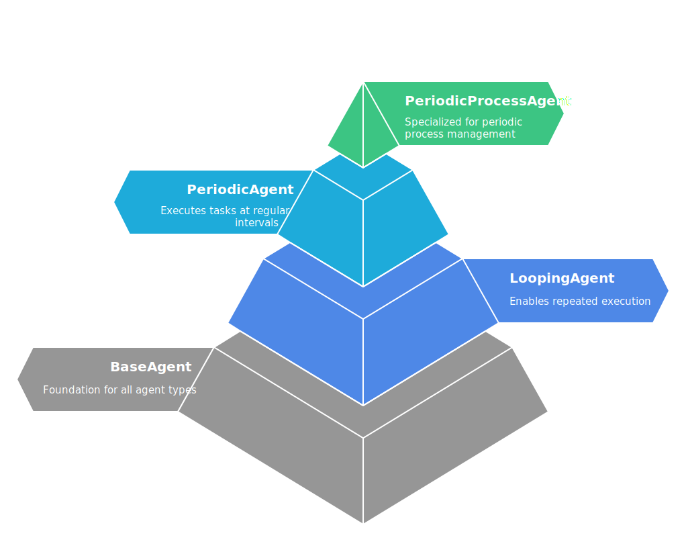
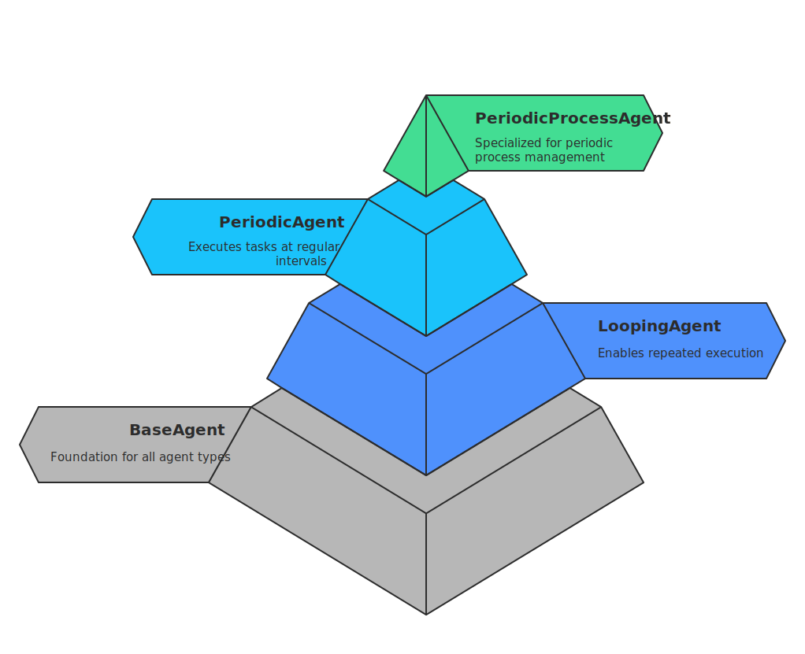
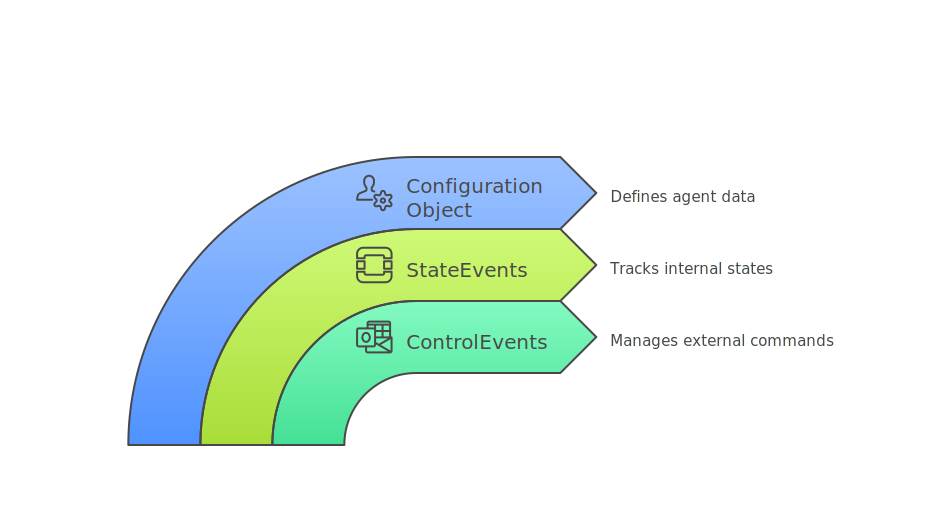
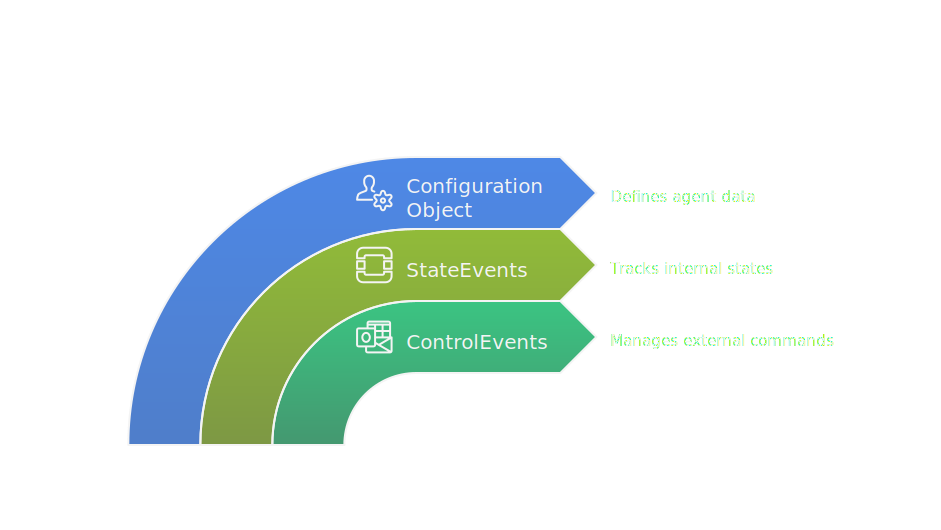
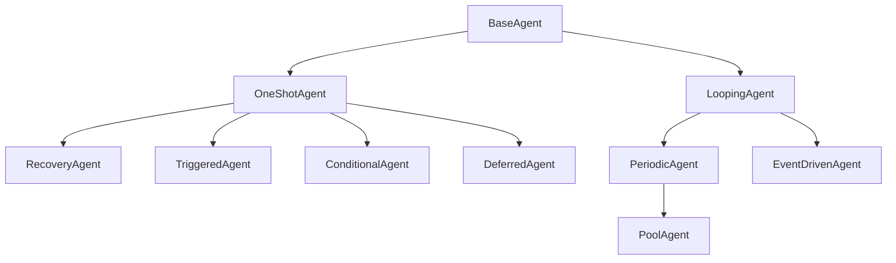
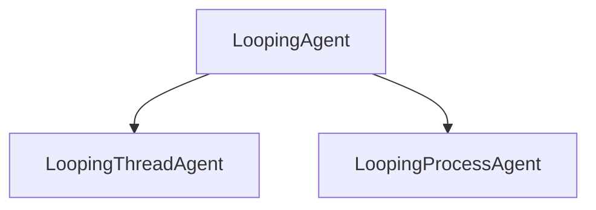

# Agents

You can think of an agent as a **container** for your custom logic, encapsulating how it runs, what it does, and how it interacts with other agents.

The framework provides a range of [built-in agents](./built-in-agents/baseagent.md) designed as extensible templates, allowing you to implement your own custom logic while leveraging their predefined structure and behavior.

All you need to do is choose the agent that best fits your requirements and inherit from it to create your own custom agent.

::: tip
For **more information**, see this [link](../core/agents/index.md).
:::

## Usage

Here’s an example of a custom agent that inherits from `PeriodicProcessAgent`.

{.light-only}
{.dark-only}

```python
class MyAgent(PeriodicProcessAgent):
    """Agent Class that logs a message periodically."""

    def setup(self):
        """
        Setup method for the agent.
        """
        super().setup()
        self.logger.info(f"FileWriter {self.name} initialized. pid={self.pid}")

    def runner(self):
        """
        Runner method for the agent.
        """
        self.logger.info("Doing some work")
```

## Overview

{.light-only}
{.dark-only}

### Configuration

Every agent has a set of **parameters** that define its own data. These parameters are stored in a `Config` object.

The `Config` class is used by the agent to **create a configuration object for itself**. 

It serves three main purposes:

| Purpose       | Description |
| ------------- |  :---- |
| built-in attributes | can be customized by users to control the agent’s behavior. |
| user-defined attributes | provides a flexible space for users to add custom attributes. |
| attributes validation | provides a validate method that can be overridden to implement custom validation logic. |

::: tip 
In every agent, the `Config` class inherits from the respective parent agent's `Config` class. This allows you to customize the agent's configuration while retaining the built-in ones.
:::

::: info Example
For example `MyAgent` class define its own configuration class via parent agent's `Config` class.

```python
class MyAgent(PeriodicProcessAgent):

    class Config(PeriodicProcessAgent.Config): # [!code focus]
        limit = 5 # [!code focus]
        output_directory = "output" # [!code focus]

    config: Config
```
:::

### **StateEvents**

Every agent has a set of **events** that signal its internal state. These events are stored in a `StateEvents` object and allow external components to **understand the agent's current state**.

The `StateEvents` class is used by the agent to **define its own state events**.

Some of the **built-in** state events are:

| State       | Description |
| ------------- |  :---- |
| `ready_event` | Event to signal that the agent is ready to start the execution. |
| `close_event` | Event to signal that the agent has completed the execution. |

::: tip 
In every agent, the `StateEvents` class inherits from the respective parent agent's `StateEvents` class. This allows you to customize the agent's state events while retaining the built-in ones.
:::

::: info Example
In our example, we didn't define any custom state events. We will discuss customizing these in more advanced topics.
:::

### **ControlEvents**

Every agent has a set of **events** that are used to send commands to the agent. These events are stored in a `ControlEvents` object and allow external systems to **control the agent’s behavior**.

The `ControlEvents` class is used by the agent to **define its own control events**.

Some of the **built-in** control events are:

| State       | Description |
| ------------- |  :---- |
| `setup_event` | Event to signal that the agent can be set up. |
| `execute_event` | Event to signal that the agent can execute its logic. |
| `stop_event` | Event to signal that the agent must stop. |

::: tip 
In every agent, the `ControlEvents` class inherits from the respective parent agent's `ControlEvents` class. This allows you to customize the agent's control events while retaining the built-in ones.
:::

::: info Example
In our example, we didn't define any custom control events. We will discuss customizing these in more advanced topics.
:::

### Plugin

The `Plugin` class is used by the agent to **create a plugin object for itself**. 

The `agent.plugin` object is useful for retrieving **built-in** or **user-initialized** **plugins**. The agent will autonomously **initialize** and **release** their resources at startup and shutdown. This ensures that the plugins are properly managed throughout the agent's lifecycle.

::: tip 
In every agent, the `Plugin` class inherits from the respective parent agent's `Plugin` class. This allows you to customize the agent's plugin while retaining the built-in ones.
:::

::: info Example
For example `MyAgent` class define its own plugin class via parent agent's `Plugin` class.

```python
class MyAgent(PeriodicProcessAgent): #

    class Plugin(PeriodicProcessAgent.Plugin): # [!code focus]
        zmq = ZmqPubSub("tcp://*:5555",zmq.PUB) # [!code focus]

    plugin: Plugin

    def runner(self):
        super().runner()

        self.logger.info("Sending message")
        self.plugin.zmq.send("hello world".encode()) # [!code focus]
```
:::

### Why Use Agents?

Agents save you from reinventing the wheel by offering ready-made solutions for common architectural challenges, such as managing threads/processes, synchronizing events, and handling errors.

## Extend and Customize

But **how do you create an agent** that fits your specific needs?

Agents are designed to be **extensible** and **customizable**. You can inherit from a built-in agent and override its methods to create your own custom agent.

::: tip
You can also **add new methods** to extend the agent’s capabilities.
:::

There are two types of methods you can override:

-   [abstract methods](#abstract-methods): These methods are required and must be overridden to define the agent’s behavior.
-   [template methods](#template-methods): These methods are optional and can be overridden to customize the agent’s behavior further.

::: warning
Be sure to call `super().method()` when overriding to ensure the agent’s core functionality is preserved.
:::

### Abstract methods

Almost every agent provides `@abstractmethod` that you need to override to define the agent’s behavior. These methods are where you implement the logic that makes your agent unique.

::: tip
In the example we made before, we are inheriting from `PeriodicProcessAgent`. 

This means we must override the `runner` method, which is an `@abstractmethod`, as mentioned in the [PeriodicAgent]() documentation.

```python
class MyAgent(PeriodicProcessAgent):
    """Agent Class that logs a message periodically."""

    class Config(PeriodicProcessAgent.Config):
        """Agent Configuration class."""
        limit = 5
        execution_interval = 1
        output_directory = "output"

    def setup(self):
        """
        Setup method for the agent.
        """
        super().setup()
        self.logger.info(f"FileWriter {self.name} initialized. pid={self.pid}")

    def runner(self): # [!code focus]
        """ # [!code focus]
        Runner method for the agent. # [!code focus]
        """ # [!code focus]
        self.logger.info("Doing some work") # [!code focus]
```
:::

### Template methods

Other methods are **optional** and can be overridden to customize the agent’s behavior further. They will be marked as `@templatemethod` in the agent’s documentation.


::: tip
In the example we made before, we are inheriting from `PeriodicAgent`. 

This means we can override the `setup` method, which is a `@templatemethod`, ensuring we call `super().setup()` at the beginning, as mentioned in the [PeriodicAgent]() documentation.

```python
class MyAgent(PeriodicProcessAgent):
    """Agent Class that logs a message periodically."""

    class Config(PeriodicProcessAgent.Config):
        """Agent Configuration class."""
        limit = 5
        execution_interval = 1
        output_directory = "output"

    def setup(self): # [!code focus]
        """ # [!code focus]
        Setup method for the agent. # [!code focus]
        """ # [!code focus]
        super().setup() # [!code focus]
        self.logger.info(f"FileWriter {self.name} initialized. pid={self.pid}") # [!code focus]

    def runner(self):
        """
        Runner method for the agent.
        """
        self.logger.info("Doing some work")
```
:::


## Hierarchical Structure

All user-defined agent must inherit first from the `BaseAgent` class or any of its subclasses ([built-in agents](./built-in-agents/baseagent.md)).

Keep in mind that **higher-level agents** (bottom) come with more built-in functionality but are less customizable, while **lower-level agents** (top) require more work but give you more control. 

The challenge is finding the highest-level agent that best fits your needs.



The hierarchical structure you see above represents only the **behavior** of an agent. Then you have the **execution mode** of an agent, which can be either a **thread** or a **process**.

For example, `LoopingAgent` can be either a `LoopingThreadAgent` or a `LoopingProcessAgent`.



::: tip
In the example we made before, `MyAgent` class inherits from `PeriodicProcessAgent`. This means that `MyAgent` will have the behavior of a `PeriodicAgent` and the execution mode of a `Process`.

```python
class MyAgent(PeriodicProcessAgent): # [!code focus]
    """Agent Class that logs a message periodically."""

    class Config(PeriodicProcessAgent.Config): 
        """Agent Configuration class."""
        limit = 5
        execution_interval = 1
        output_directory = "output"
```
:::

## Validation Policy

The `Config` class provides a `validate` method that can be overridden to implement custom validation logic.

```python
class Config(BaseClassConfig):
    """Configuration with a single custom field and simple validation."""

    threshold: int = 10
    validation_policy = ValidationPolicy(ignore_warnings=False, ignore_errors=False)

    def validate(self) -> List[ValidationResult]:
        results = super().validate()
        if self.threshold < 0 or self.threshold > 30:
            results.append(
                ValidationResult(
                    field="threshold",
                    is_valid=False,
                    message="Threshold must be between 0 and 30.",
                    severity=ValidationSeverity.ERROR,
                )
            )
        return results
```

You can also use the `ValidationPolicy` class to define how validation errors are handled.

## BaseAgent

The `BaseAgent` class is the foundation for all agents in PyOrchestrate. It provides the basic structure and functionality that all agents inherit.

Click [here](./built-in-agents/baseagent.md) to learn more about the `BaseAgent`.
