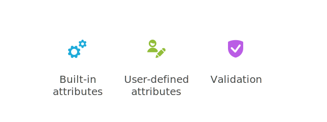
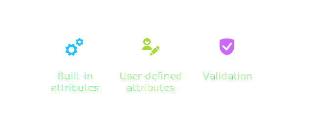

# Config and Validation

{.light-only}
{.dark-only}

Every Agent and Orchestrator in PyOrchestrate comes with a **Config object**.  
You can think of it as the **blueprint** that defines how each component behaves.  

Instead of hard-coding parameters in your classes, `Config` provides a structured way to:  

- Store **built-in attributes** (loop interval, execution mode, etc.).  
- Add **user-defined attributes** (output paths, thresholds, custom values).  
- Validate parameters before execution (see the [Validation](#validation) section).  

## How It Works

A `Config` class is always defined inside its parent (Agent or Orchestrator).  

- **Defaults:** class attributes define default values.  
- **Override in class:** you can subclass and redefine defaults.  
- **Override at runtime:** you can pass values directly to the constructor.  

```python
class MyAgent(PeriodicProcessAgent):

    class Config(PeriodicProcessAgent.Config):
        # Overriding Built-in attribute, inherited from parent
        limit = 5

        # User-defined attribute
        output_directory = "output"

    config: Config

# Override at runtime
custom_config = MyAgent.Config(limit=10, output_directory="custom")
```

::: tip 
The `Config` class inherits from the respective parent's `Config` class. This allows you to customize the configuration while retaining the built-in ones.
:::

## Built-in vs User-Defined Attributes

- **Built-in attributes**: provided by the base class, control core behavior.  
- **User-defined attributes**: defined by you, tailored to your custom logic.  

Both are treated the same way by the framework, which means you can freely mix them.  

::: tip
All **built-in attribute** are well documented. For example, see [LoopingAgent Configuration](./agents/built-in-agents/loopingagent.md#configuration):
::: 

## Validation

Having a `Config` object is great, but how do you make sure its values are correct?  
That’s where **validation** comes in.  

Before an Agent or Orchestrator starts, its `Config` is checked.  
If something looks wrong, validation can **stop the execution** or just **warn** you (depending on how strict you want to be).

### Custom Validation

Every `Config` has a `validate` method you can override.  
This lets you add **custom rules** for your own attributes.

```python
class Config(BaseClassConfig):
    """Configuration with a single custom field and simple validation."""

    threshold: int = 10

    def validate(self):
        results = super().validate()

        # Raise ERROR if threshold is not between 0 and 30
        if self.threshold < 0 or self.threshold > 30:
            results.append(
                ValidationResult(
                    field="threshold",
                    message="Threshold must be between 0 and 30.",
                    severity=ValidationSeverity.ERROR,
                )
            )
        return results
```

### Validation Policy

By default, validation applies reasonable checks.  
But you can override the `validation_policy` attribute to decide how strict it should be.

```python
from PyOrchestrate.core.utilities.validation import ValidationPolicy

class Config(BaseClassConfig):
    threshold: int = 10
    validation_policy = ValidationPolicy(
        ignore_warnings=False,
        ignore_errors=False
    )
```

This allows you to:  
- Ignore warnings (useful in development).  
- Enforce errors strictly (ideal for production).  

---

### Validation Severity

Not all validation results are the same.  
Each issue is tagged with a **severity level**:

| Severity       | Description |
| -------------- | :---------- |
| `WARNING`      | The component will still start, but a log message is produced. |
| `ERROR`        | The component will not start. Used for critical misconfigurations. |
| `CRITICAL`     | Checks that must **never** be ignored. Reserved for essential rules in built-in Agents. |

---

## Why It Matters

Validation gives you **confidence**.  
You know that when your Orchestrator or Agent starts, it’s running with parameters that make sense.  

It saves you from:  
- hidden bugs caused by typos in configs,  
- confusing runtime errors,  
- agents starting with unsafe defaults.  

Think of validation as your **safety net**: it lets you catch mistakes early and keep your system predictable.
