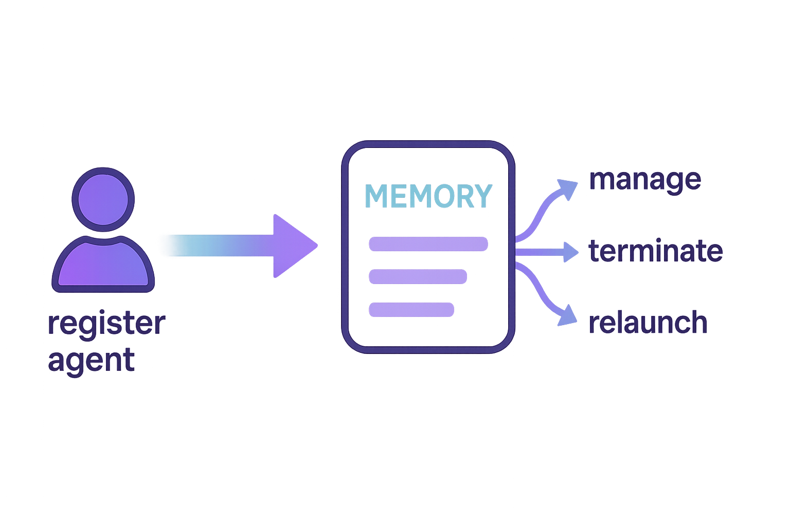

# Orchestrator

The **Orchestrator** is a central component responsible for coordinating multiple **Agents** and managing their lifecycle. It ensures seamless communication among **Agents** and serves as a single point for controlling the entire flow.

## Registration

The first step in using the Orchestrator is to **register** the **Agents** you want to manage. 

This is done through the `register_agent` method, which takes the class of the agent and an optional name. The Orchestrator keeps track of all registered agents, allowing you to start them in a controlled manner.

::: tip
Under the hood, registering an **Agent** means wrapping it inside an `AgentEntry` object and storing it in memory. 

This entry holds the **Agent class** along with all the **configuration**, **plugins**, **control/state events**, and **runtime parameters**.

If you need more details about Agent's parameters, please refer to the [Agent](../../agents/index.md) documentation.
:::

## Lifecycle Management

Once all Agents have been registered, the Orchestrator initiates the execution flow by performing a series of well-defined steps:

-   **Dependency validation**: it checks that all declared dependencies refer to existing Agents and ensures that there are no cycles. This produces a valid topological order where each Agent is guaranteed to start only after its prerequisites.
    
-   **Agent initialization and startup**: for each Agent, the Orchestrator retrieves the corresponding `AgentEntry` from memory, initializes its instance with the provided configuration, plugin, and events (or creates default ones if not provided), then starts it as a process or thread. Upon startup, an `AGENT_STARTED` event is emitted, including the name of the started Agent.
    
-   **Monitoring and dynamic activation**: during execution, the Orchestrator periodically checks which Agents are still alive. When an Agent completes, it emits an `AGENT_TERMINATED` event.
    
-   **Completion detection**: the lifecycle loop continues until all Agents have finished and the queue is empty. At this point, a final `ALL_AGENTS_TERMINATED` event is emitted, signaling that the system has completed its work.
    
-   **Synchronization and shutdown**: developers can call `join()` to block the main thread until all Agents terminate, ensuring a clean shutdown. Alternatively, `simple_join()` offers a minimal waiting mechanism without managing events or dependencies.

## Concurrency Control and Queue Handling
To optimize resource usage and avoid overloading the system, the Orchestrator allows developers to define a concurrency limit using the `max_workers` parameter. This setting caps the number of Agents that can run simultaneously.

When the limit is reached, any additional Agents are placed into an internal waiting queue. As soon as a running Agent finishes, the Orchestrator automatically starts the next one in line, ensuring a smooth, balanced execution flow.

## Event-Driven Coordination
The Orchestrator emits structured events throughout the lifecycle of the Agents. These include events for when an Agent starts, terminates, or when all Agents have completed. These events are broadcast through an internal Event Manager and can be used to monitor system health, update dashboards, or trigger reactions in external services.

This reactive behavior enables a high degree of observability and external integration, allowing the orchestration layer to be plugged into larger monitoring or alerting systems.

## Hierarchical and Scalable Architecture
The orchestration logic supports recursive orchestration: an `Agent` can itself be an `Orchestrator` managing its own set of `threads` or `subprocesses`. This makes it possible to build multi-level hierarchies where a top-level Orchestrator supervises multiple sub-managers, each with their own specialized workload.

Such flexibility is crucial for large-scale applications where responsibilities are split across domains or computation units.

## Flexible Configuration
The Orchestrator provides configurable options for its behavior, including:

- check_interval: how often to inspect the status of running Agents.
- max_workers: the cap on concurrent executions.

These options can be fine-tuned based on the expected workload or hardware capacity, giving the developer full control over orchestration dynamics.

## Simpler Execution Mode
For use cases that don't require dependency resolution, concurrency control, or event emission, the Orchestrator also provides a simple_join() method. This method merely waits for all Agents to finish, acting as a synchronization barrier without the additional orchestration logic.

## Runtime Reporting and Insights
At any point during execution, the Orchestrator can report the status of all registered Agents, including their activity, process/thread identity, and whether they are alive. This is particularly useful for diagnostics and monitoring, especially in long-running or critical workloads.

It also keeps track of each Agent’s lifecycle history — a chronological log of events like start, stop, and join, with timestamps — providing visibility into the execution timeline.