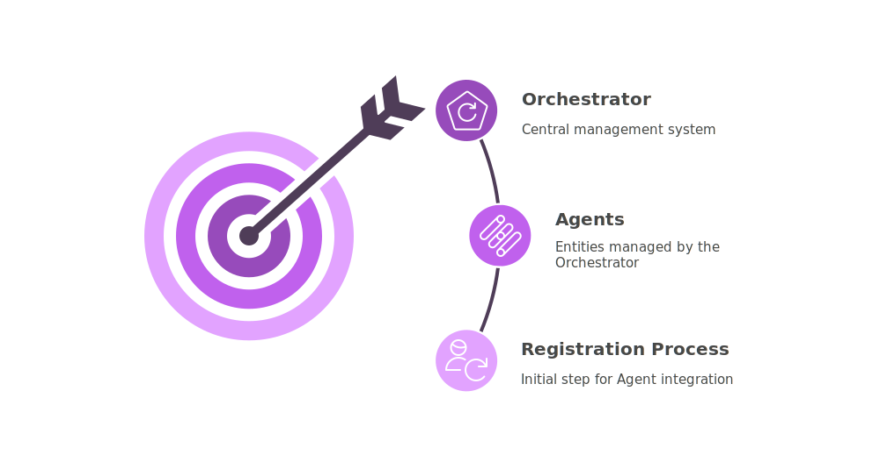
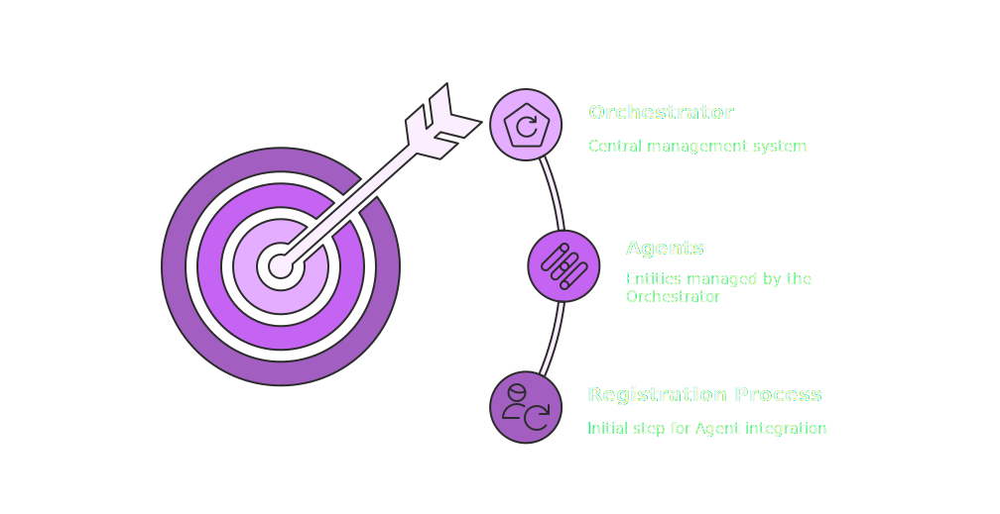
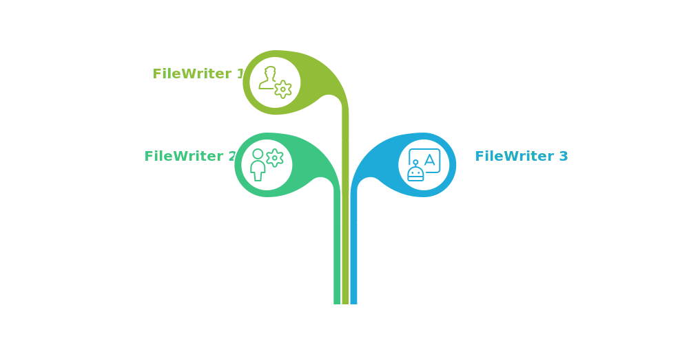
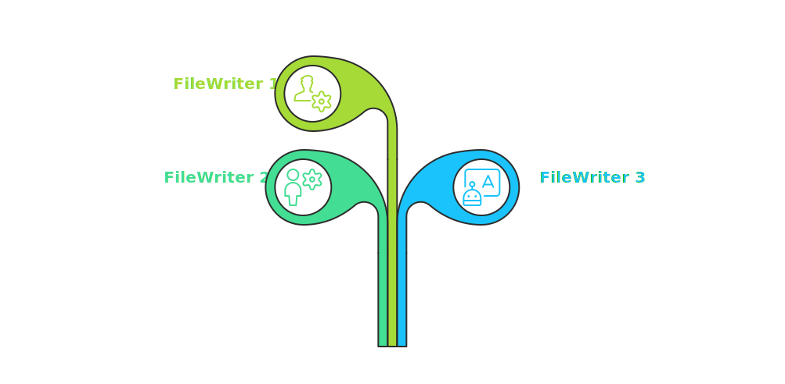
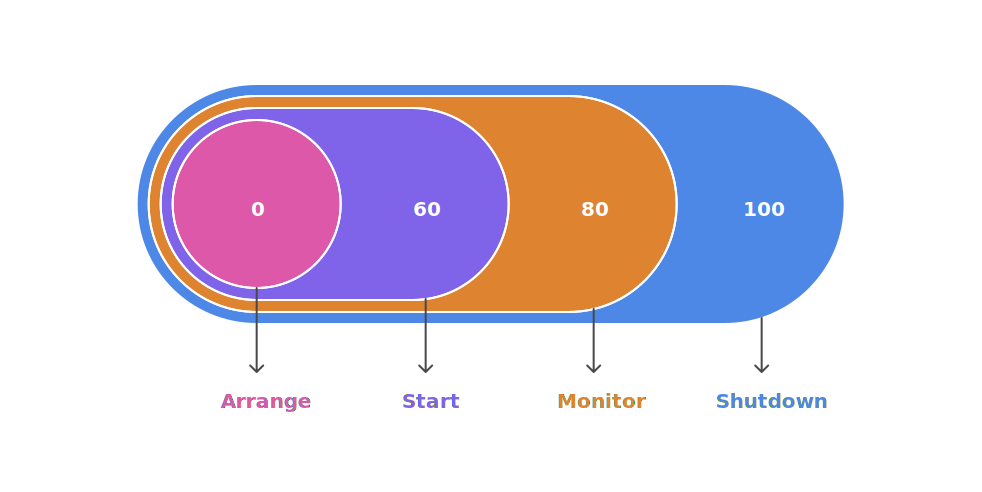
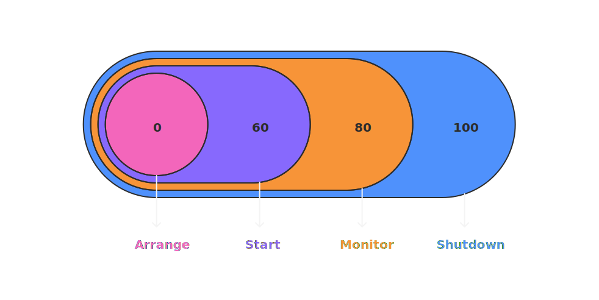

# Orchestrator

The **Orchestrator** is the component in charge of supervising and coordinating your **Agents**. It takes care of starting them, managing their lifecycle, and making sure everything runs smoothly — whether you're using threads, processes, or a mix of both.

## 🟢 Getting Started

### Registering Agents

{.light-only}
{.dark-only}

Before using the Orchestrator, you need to **register the Agents** you want it to manage.

This is done using the `register_agent()` method. You just provide:

- the Agent class,
- a unique name,
- and (optionally) a custom configuration or extra parameters.

Once registered, the Orchestrator knows how to **start**, **monitor**, and **stop** the Agent.

::: tip Behind the scenes
Each Agent is wrapped in an `AgentEntry` object that stores everything needed: the class, config, events, and more.
:::

### Running Multiple Agents of the Same Class

You can reuse the same **Agent class** to run **multiple Agents** that do slightly different things, all by changing their configuration.

For example, imagine you have a `FileWriterAgent` that writes data to a file. By passing a different file path to each one during registration, you can launch two Agents from the same class: one that writes to `log_a.txt` and another that writes to `log_b.txt`.

{.light-only style="display: block; margin: 0 auto; width: 100%"}
{.dark-only style="display: block; margin: 0 auto; width: 100%"}

::: tip
- For more details on how to register Agents, check out the [Orchestrator Registering Agents](../../orchestrator/index.md#registering-agents).
- For more details on Agent's parameters and configuration, check out the [Agent Overview](../../agents/index.md#overview).
:::

## ⚙️ Execution Lifecycle

### Lifecycle policy (RunMode)

The Orchestrator’s liveness is governed by an explicit lifecycle policy called `RunMode` and it’s required in the orchestrator configuration.

- `STOP_ON_EMPTY` — batch-like: the orchestrator exits when all agents have completed and the queue is empty.
- `DAEMON` — service-like: the orchestrator stays alive until you explicitly shut it down, even if there are no running agents.

### How Agent Execution Works

{.light-only}
{.dark-only}

This section describes how execution proceeds; final liveness depends solely on the selected `RunMode`:

1. **Check dependencies**  

   Before starting any Agent, the Orchestrator verifies that all declared dependencies exist and there are no circular references. It builds a valid startup order so each Agent launches only after its prerequisites.

2. **Start Agents**

    The Orchestrator starts each Agent based on its dependency order using the Agent class's `start()` method. Depending on your configuration, this can run in a separate thread or process.

3. **Monitor running Agents**  

   The Orchestrator keeps track of all active Agents. When one finishes, it emits an `AGENT_TERMINATED` event and starts the next queued Agent, if any.

4. **Graceful termination vs. daemon behavior**  

   When all Agents have completed and the queue is empty, the Orchestrator emits an `ALL_AGENTS_TERMINATED` event. In `STOP_ON_EMPTY` it then terminates. In `DAEMON` it remains alive until you request shutdown.

::: tip
You can subclass the `Orchestrator` class to change its behavior and plug in your own logic.
:::

### Managing Parallel Execution

The Orchestrator supports **concurrency limits** to avoid overloading your system. You can define a `max_workers` value to cap how many Agents can run at the same time.

If the limit is reached, additional Agents are treated as **queued Agents**: they wait in line until a slot becomes available. As soon as one of the running Agents finishes, the next queued Agent is started automatically.

### A Simpler Way to Wait

If you don’t need advanced lifecycle control or event tracking, the Orchestrator also offers a `simple_join()` method. It blocks until the orchestrator terminates according to its `RunMode` (in `DAEMON`, you’ll need to explicitly shut it down for it to return).

## 🔔 Events and Monitoring

### Reacting to Events

As Agents run, the Orchestrator emits events at key moments — when they start, stop, or when everything is done. These events flow through an **Event Manager**, and you can hook into them to trigger alerts, logs, dashboards, or custom reactions.

This makes your system not only coordinated, but also observable and responsive to change.

### Seeing What’s Happening

At any moment, you can ask the Orchestrator to report the status of all Agents: whether they’re running, what their process/thread ID is, and more.

It also logs each Agent’s lifecycle, including events like `start`, `stop`, and `join`, along with timestamps. This makes debugging and monitoring much easier, especially in long-running or production systems.

## 🧠 Advanced Control

### Advanced Features and Observability

You can optionally organize your Agents into **Groups**, allowing you to logically separate them by function, priority, or execution phase. A Group is simply a named collection of Agent names. You can add or remove Agents from groups and later retrieve all instances in a group. This is useful for batch operations or context-based orchestration.

The Orchestrator also maintains an internal history of all events for each Agent — including `start`, `stop`, and `join` — complete with timestamps. This history can be retrieved at any time using the `get_agent_stats(name)` method and is particularly useful for auditing, debugging, or tracking execution timelines.

You can even use one Orchestrator as an Agent inside another, allowing you to build **hierarchical orchestration layers**, where a top-level Orchestrator supervises others that manage their own subprocesses or threads.

If an Agent crashes or encounters an unhandled exception, the Orchestrator will still detect its termination. You can inspect its status or decide to manually restart it using the `restart()` method. This allows for basic fault tolerance and recovery strategies in more resilient systems.

### Customizing the Behavior

You can adjust how the Orchestrator behaves using its configuration `Orchestrator.Config`:

- `check_interval`: how often it checks the status of running Agents
- `max_workers`: how many Agents can run in parallel
- `run_mode` (required): lifecycle policy (`STOP_ON_EMPTY` or `DAEMON`). The CLI, if enabled, does not affect this policy.

::: tip

For more details on the Orchestrator's configuration, check out the [Orchestrator Configuration](../../orchestrator/index.md#configuration).
:::