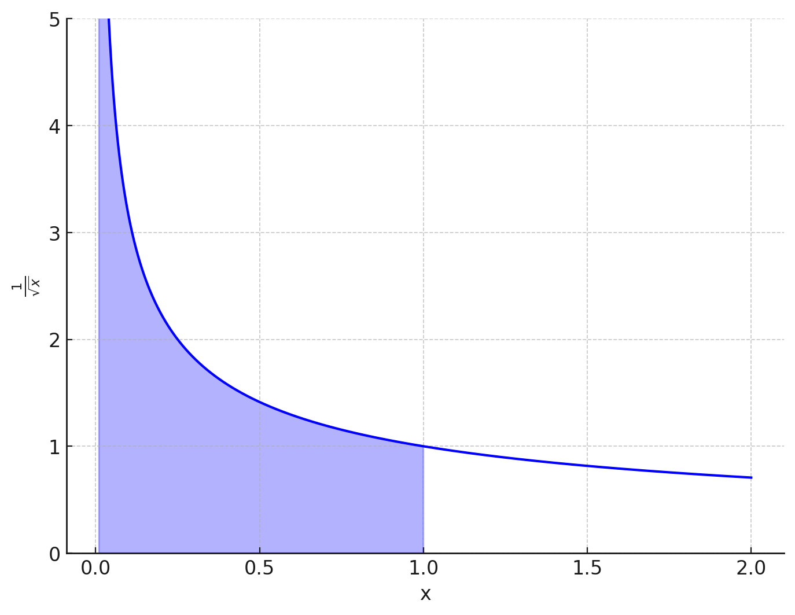

# Improper Integrals

So far, we have always defined the concept of **integral** under the conditions that $f$ was a bounded function and that $I$ was a bounded interval.

Now let's see how these hypotheses can be extended to cases where $f$ and/or $I$ are not bounded.

::: tip Theorem

Let $f: (a, b] \to \mathbb{R}, \ a \in \mathbb{R} \cup \{-\infty\}, \text{ such that } f \text{ is integrable in } [\omega, b] \ \forall \omega \in (a, b]$.

If the limit exists in $\mathbb{R}^*$

$$
\lim_{\omega \to a^+} \int_{\omega}^{b} f(x) \, dx
$$

this limit is called the **improper** or **generalized** integral of $f$ in $(a, b]$.

Now, if the limit exists and is finite:
- $f$ is **improperly integrable** in $(a, b]$ and the improper integral of $f$ is **convergent**.

On the other hand, if it exists but is not finite:

- the improper integral of $f$ is said to be **divergent** in $(a, b]$.
:::

::: tip Theorem

Let $f: [a, b) \to \mathbb{R}, \ b \in \mathbb{R} \cup \{\infty\}, \text{ such that } f \text{ is integrable in } [a, \lambda] \ \forall \lambda \in [a, b)$.

If the limit exists in $\mathbb{R}^*$

$$
\lim_{\lambda \to b^-} \int_{a}^{\lambda} f(x) \, dx
$$

this limit is called the **improper** or **generalized** integral of $f$ in $[a, b)$.

Now, if the limit exists and is finite:
- $f$ is **improperly integrable** in $[a, b)$ and the improper integral of $f$ is **convergent**.

On the other hand, if it exists but is not finite:

- the improper integral of $f$ is said to be **divergent** in $[a, b)$.
:::

Let's prove the theorem with an example...

$$
\int_{a}^{b} x^{-k}dx
$$

With $x \in \mathbb{R^+}$, $k \in \mathbb{R}$ and $0 < a < b$.

We need to distinguish two cases based on the value of $k$, indeed

- if $k = 1$

$$
\int_{a}^{b} x^{-k}dx = \int_{a}^{b} \frac{1}{x} = \ln |x| \bigg\rvert_{a}^{b}
$$

- if $k \neq 1$

$$
\int_{a}^{b} x^{-k}dx = \int_{a}^{b} \frac{1}{x^k}dx = \frac{x^{1 - k}}{1 - k} \bigg\rvert_{a}^{b}
$$

Now let's proceed by fixing, for example, $b = 1$

- if $k = 1$

$$
\int_{a}^{1} x^{-k}dx = - \ln (a)
$$

- if $k \neq 1$

$$
\int_{a}^{1} x^{-k}dx = \frac{1}{1 - k} - \frac{a^{1-k}}{1 - k}
$$

Now we need to calculate the limit

$$
\lim_{a \to 0^+} \int_{a}^{1} x^{-k}dx
$$

- if $k = 1$

$$
\lim_{a \to 0^+} - \ln (a) = \infty
$$

This limit **is not convergent**.

- if $k \neq 1$

$$
\lim_{a \to 0^+} \frac{1}{1 - k} - \frac{a^{1-k}}{1 - k}
$$

This limit **is convergent if and only if** $1 - k > 0$ that is $k < 1$.

Under this hypothesis, the limit is

$$
- \frac{1}{1 - k}
$$

We have thus demonstrated that

$$
f(x) = \frac{1}{x^k} \text{ is improperly integrable in } (0, 1] \text{ if } k < 1
$$

----

A similar argument holds if we set $a = 1$ and let $b$ go to infinity.

In this case, we obtain

$$
f(x) = \frac{1}{x^k} \text{ is improperly integrable in } [1, \infty) \text{ if } k > 1
$$

::: tip Graph of $f(x) = \frac{1}{\sqrt{x}}$

This example contains a surprising result!

It is possible for the area under an unbounded function over an interval to have a finite value, indeed

$$
f(x) = \frac{1}{\sqrt{x}} \text{ is improperly integrable in } (0, 1] \text{ because } k = \frac{1}{2} < 1
$$

Performing the calculations, we get

$$
\lim_{a \to 0^+} \int_{a}^{1} \frac{1}{x^{\frac{1}{2}}}dx = \lim_{a \to 0^+} 2 x^{\frac{1}{2}} \bigg\rvert_{a}^{1} = \lim_{a \to 0^+} 2( 1 - a^{\frac{1}{2}} ) = 2
$$

as shown in the previous theorem.

> In this case, the function is **unbounded** as $x \to 0$.

:::

