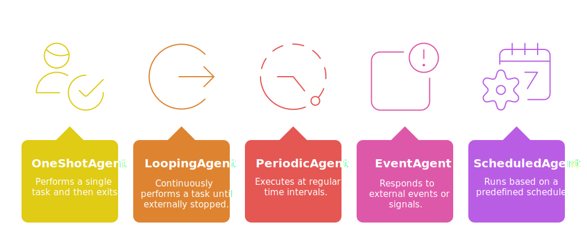
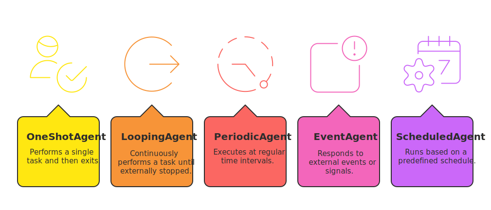
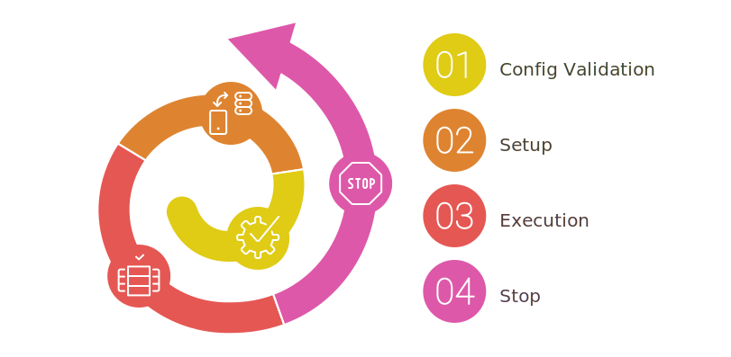
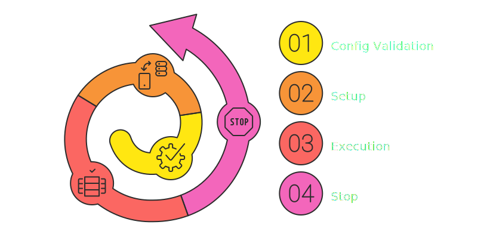
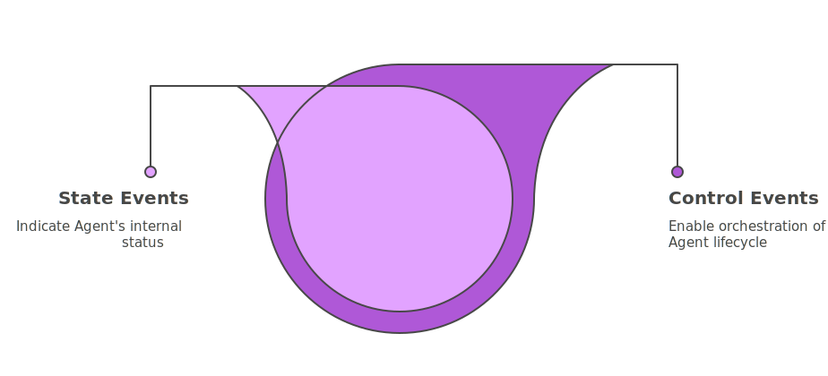
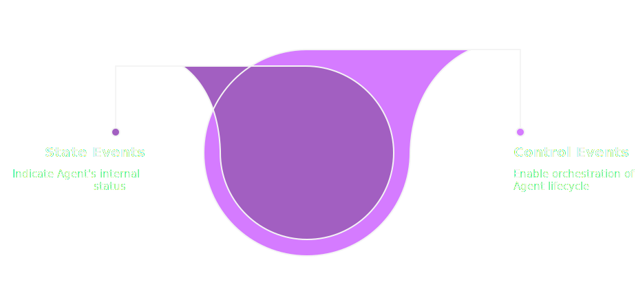

# How Agents Works

**Agents** are the core execution units managed by the Orchestrator. 

Each Agent encapsulates a specific task and can run either in a separate **thread** or **process**. The Agent class provides a standardized lifecycle and configuration system, allowing you to focus solely on your business logic.

## Getting Started

### Agent Types

{.light-only}
{.dark-only}

Agents can be implemented in different styles, depending on their intended behavior:

- **OneShotAgent**: performs a single task and then exits.
- **LoopingAgent**: continuously performs a task until externally stopped.
- **PeriodicAgent**: executes at regular time intervals.
- **EventAgent**: responds to external events or signals.
- **ScheduledAgent**: runs based on a predefined schedule.

Each one builds on top of the core logic provided by `BaseAgent`, inheriting its lifecycle and configuration support.

::: tip
To learn more about the different Agent types, check out the [Hierarchical Structure](../../agents/index.md#hierarchical-structure) section.
:::

### Configuration

Each Agent has a `Config` class that defines its settings, like how often it runs or where it saves output. You can override these defaults or extend the class for custom options, making Agents flexible and safe to use.

Built-in Agents use their configuration class to manage essential parameters. For example, the `LoopingAgent` defines options like loop interval and stop conditions in its config. 

::: tip Example
See the [LoopingAgent Config](../../../learn/agents/built-in-agents/loopingagent.md#configuration) for more details.
:::

### Plugin System

Agents support plugins to extend their capabilities. Plugins are automatically initialized and finalized with the Agent, and can be used to modularize logic or add monitoring, transformation, or communication features.

### Thread vs Process

Agents can run as:

- **Thread-based**: share memory, lightweight, best for I/O-bound tasks.
- **Process-based**: isolated, resilient, ideal for CPU-intensive or crash-prone tasks.

This is defined at the time of Agent creation and is managed internally by the Orchestrator.

## Lifecycle

{.light-only}
{.dark-only}

All Agents follow a standardized lifecycle:

1. **Config Validation**  
   The Agent checks its configuration for correctness. If any issues are found, the Agent will not start.

2. **Setup**  
   Executed before the task starts. Use this step for initialization and preparation.

3. **Execution**  
   The core of the Agent. This is where the main task is performed — once, repeatedly, or on trigger.

4. **Stop**  
   When the Orchestrator requests a stop or the Agent finishes its tasks.

Throughout this lifecycle, internal and external events are used to synchronize actions and manage state transitions.

## Observability and Events

Each Agent manages two kinds of event systems.

{.light-only}
{.dark-only}

### MessageChannel

Agents do not emit events directly. Instead, when an agent needs to signal an event (such as a state change or a lifecycle transition), it sends a message through a **MessageChannel** to the Orchestrator. The Orchestrator then receives this message and emits the corresponding event using its EventManager. This architecture ensures a clear separation between agent logic and event handling, and allows for centralized monitoring and control.

**Event flow:**
```
Agent → MessageChannel → Orchestrator → EventManager → Callbacks
```

### State Events 

These represent the internal status of the Agent. They indicate key lifecycle transitions such as:

- when the Agent is starting
- when it's ready to execute
- when it has completed its task

These events are useful for **observing** the current state of each Agent and synchronizing other components in the system.

::: tip
To learn more about the different events, check out the [Agent State Events](../../agents/index.md#stateevents) section.
:::

### Control Events  

These allow the Orchestrator (or other Agents) to **drive** the Agent's lifecycle. They are used to signal when the Agent is allowed to:

- start the setup phase
- begin execution
- stop gracefully

Control events give you fine-grained control over each phase of execution, allowing custom orchestration strategies.

::: tip
To learn more about the different events, check out the [Agent Control Events](../../agents/index.md#controlevents) section.
:::

## Validation and Safety

Each Agent comes with a built-in system to check if its configuration is correct before it starts running. This helps catch mistakes early and keeps your system safe and predictable.

### Validation Policy

The configuration of every Agent is checked using a `ValidationPolicy`. This lets you define how strict the validation should be for each setting.

You can assign different severity levels to each validation rule using `ValidationSeverity`:

- `warning`: the Agent will still start, but you’ll get a log message letting you know something might need attention.
- `error`: the Agent won’t start, and an error will be logged — this is used for serious issues that could break execution.

::: tip
   There’s also a special severity level: `critical`.  
   This one is used by some built-in Agents for essential checks that must **never** be ignored.  
:::

::: tip
To learn more about the different validation policies, check out the [Validation](../../agents/index.md#validation) section.
:::

## Grouping and Control

Agents can be grouped into **logical collections**, allowing the Orchestrator to manage them together. Groups can be used to filter Agents by function, priority, or lifecycle stage.

This enables bulk operations like restarting, stopping, or monitoring only a subset of Agents.