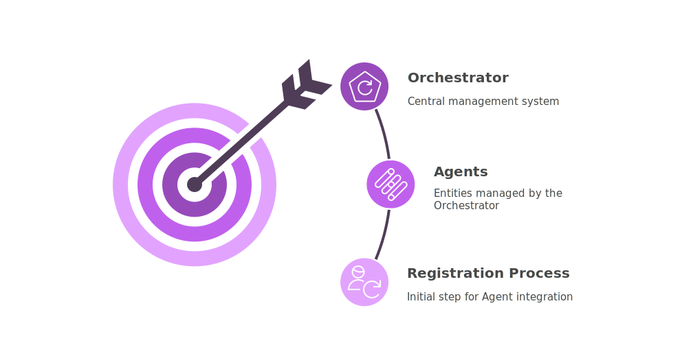

# How Orchestration Works

The **Orchestrator** is the component in charge of supervising and coordinating your **Agents**. It takes care of starting them, managing their lifecycle, and making sure everything runs smoothly — whether you're using threads, processes, or a mix of both.

## Managing Agents

### Registering Agents

{.light-only}
{.dark-only}

Before using the Orchestrator, you need to **register the Agents** you want it to manage.

This is done using the `register_agent()` method. You just provide:

- the Agent class,
- a unique name,
- and (optionally) a custom configuration or extra parameters.

Once registered, the Orchestrator knows how to **start**, **monitor**, and **stop** the Agent.

::: tip Behind the scenes
Each Agent is wrapped in an `AgentEntry` object that stores everything needed: the class, config, events, and more.
:::

### Running Multiple Agents of the Same Class

You can reuse the same **Agent class** to run **multiple Agents** that do slightly different things, all by changing their configuration.

For example, imagine you have a `FileWriterAgent` that writes data to a file. By passing a different file path to each one during registration, you can launch two Agents from the same class: one that writes to `log_a.txt` and another that writes to `log_b.txt`.

{.light-only style="display: block; margin: 0 auto; width: 100%"}
{.dark-only style="display: block; margin: 0 auto; width: 100%"}

::: tip
- For more details on how to register Agents, check out the [Orchestrator Registering Agents](../../orchestrator/index.md#registering-agents).
- For more details on Agent's parameters and configuration, check out the [Agent Overview](../../agents/index.md#overview).
:::

## Execution Lifecycle

### Run Mode

The Orchestrator’s liveness is governed by an explicit lifecycle policy called `RunMode` and it’s required in the orchestrator configuration.

- `STOP_ON_EMPTY` — batch-like: the orchestrator exits when all agents have completed and the queue is empty.
- `DAEMON` — service-like: the orchestrator stays alive until you explicitly shut it down, even if there are no running agents.

### How Agent Execution Works

{.light-only}
{.dark-only}

This section describes how execution proceeds; final liveness depends solely on the selected `RunMode`:

1. **Check dependencies**  

   Before starting any Agent, the Orchestrator verifies that all declared dependencies exist and there are no circular references. It builds a valid startup order so each Agent launches only after its prerequisites.

2. **Start Agents**

    The Orchestrator starts each Agent based on its dependency order using the Agent class's `start()` method. Depending on your configuration, this can run in a separate thread or process.

3. **Monitor running Agents**  

   The Orchestrator keeps track of all active Agents. When one finishes, it emits an `AGENT_TERMINATED` event and starts the next queued Agent, if any.

4. **Graceful termination vs. daemon behavior**  

   When all Agents have completed and the queue is empty, the Orchestrator emits an `ALL_AGENTS_TERMINATED` event. In `STOP_ON_EMPTY` it then terminates. In `DAEMON` it remains alive until you request shutdown.

::: tip
You can subclass the `Orchestrator` class to change its behavior and plug in your own logic.
:::

### Parallel Execution & Concurrency Limits

The Orchestrator supports **concurrency limits** to avoid overloading your system. You can define a `max_workers` value to cap how many Agents can run at the same time.

If the limit is reached, additional Agents are treated as **queued Agents**: they wait in line until a slot becomes available. As soon as one of the running Agents finishes, the next queued Agent is started automatically.

### A Simpler Way to Wait

Sometimes you don’t need fine-grained lifecycle control or detailed event tracking.  
If all you want is to **start the Orchestrator and wait until it finishes**, there’s a shortcut: `simple_join()`.

Think of it as a **“just run it” button**.  

- In `STOP_ON_EMPTY` mode: the Orchestrator will exit once all Agents have completed.  
- In `DAEMON` mode: the Orchestrator will keep running until you explicitly shut it down.  

This is ideal for **quick tests, prototypes, or simple automation tasks**, where you don’t need advanced orchestration logic.  

## Events and Monitoring

### Reacting to Events

As Agents run, the Orchestrator emits events at key moments — when they start, stop, or when everything is done. These events flow through an **Event Manager**, and you can hook into them to trigger alerts, logs, dashboards, or custom reactions.

This is useful when you need to **execute specific logic in response to Agent lifecycle events**, such as notifying users or updating system status.

### CLI

PyOrchestrate provides a runtime **command interface** (`CLI`) that communicates with the Orchestrator over a dedicated communication channel — a `UNIX socket` — much like how **Docker** talks to its daemon.  

This channel lets external tools interact with the Orchestrator in real time:  

- **Start or stop agents**  
- **Inspect running agents**  
- **Collect statistics and performance metrics**  
- **Query event history for auditing and debugging**  

The same command and data surface exposed by the CLI can also be used by a **web-based interface**, so dashboards and remote-control UIs can access the same functionality. 

::: tip Learn More
See the [CLI Documentation](/cli/) for the full command reference, security notes, and examples of both CLI and web interfaces.
:::

## Customizing the Behavior

Every system has different needs:  
- Some run like **services** that never stop.  
- Others behave more like **batch jobs**, doing their work and then exiting.  
- In some cases, you may want strict concurrency limits, detailed monitoring, or custom startup logic.  

To adapt to these scenarios, the Orchestrator provides a dedicated configuration object: `Orchestrator.Config`.  
Through this object, you can **fine-tune how the Orchestrator behaves**, without changing your code.  

::: tip
For the complete technical details and available options, see:  
[Orchestrator Configuration](../../orchestrator/index.md#configuration).
:::

## Why Use the Orchestrator?

The Orchestrator is not just a “manager of agents” — it’s the **central brain of your system**.  
It ensures that your agents cooperate, remain observable, and can be controlled at runtime.  

Here are some **typical use cases** where the Orchestrator shines:

- **Data Pipelines**: start data collectors, processors, and writers in sequence or parallel, ensuring each stage runs only when ready.  
- **Monitoring Systems**: keep multiple agents alive as background services, with events feeding into dashboards or alerts.  
- **Automation Workflows**: coordinate different tasks (file watchers, API pollers, message processors) in a single, unified process.  
- **Resilient Applications**: recover gracefully when an agent crashes, restart it, and keep the system stable without manual intervention.  

By abstracting away threads, processes, and low-level synchronization, the Orchestrator lets you focus on **what your agents do**, not on **how they’re coordinated**.  