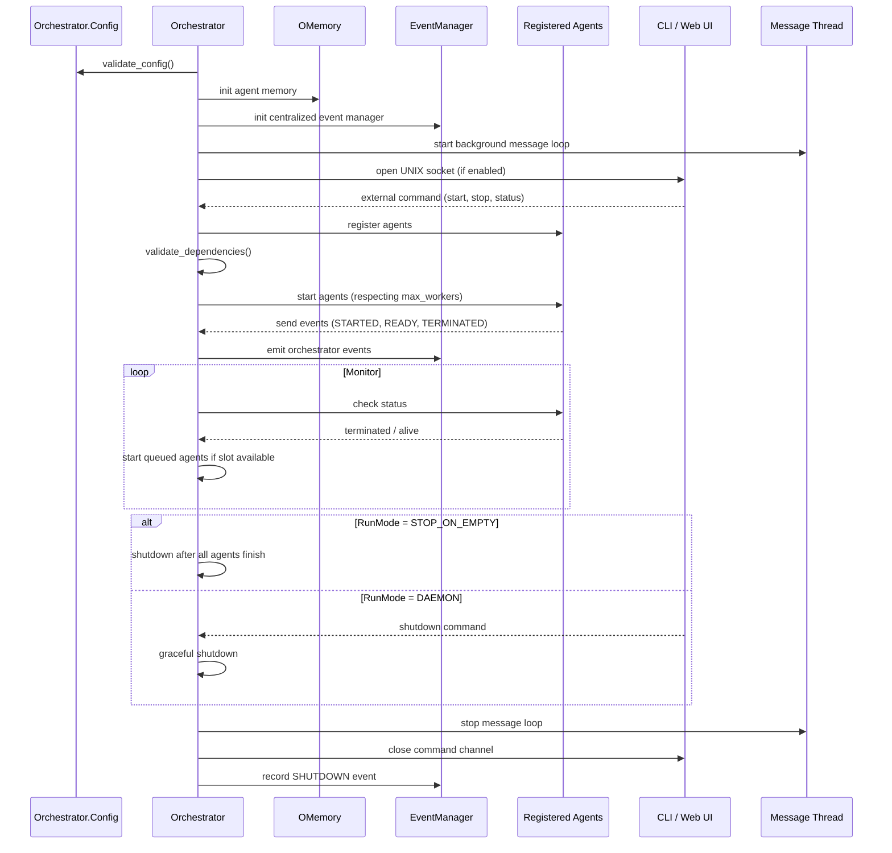

# BaseOrchestrator

The **BaseOrchestrator** is the foundation of all other orchestrators in PyOrchestrate. It provides the basic structure for any custom orchestrator.

## Why use BaseOrchestrator?

Use it as a starting point to create your own orchestrators with completely custom behavior.

## Sequence Diagram

The sequence diagram below illustrates the lifecycle of the `BaseAgent` after it is started.



## Configuration

The `BaseAgent` class defines its own configuration object via the `Config` class.

| Attribute | Default | Description |
|-----------|---------|-------------|
| `logger_config` | `LoggerConfig()` | Defines configuration for the logger. |
| `validation_policy` | `ValidationPolicy()` | Defines the validation policy. |
| `check_interval` | 1 | The interval (in seconds) at which the Orchestrator checks the status of agents. |
| `max_workers` | 5 | The maximum number of worker threads to use for executing tasks. |
| `enable_command_interface` | True | Enable external command interface via UNIX socket (runtime CLI). |
| `command_socket_path` | `/tmp/pyorchestrate.sock` | Filesystem path used for the UNIX socket when the command interface is enabled. |
| `allowed_commands` | None | Restricts which external commands are accepted by the CLI: a set of command names, a preset name (string), or `None` to allow all commands. |
| `run_mode` | `STOP_ON_EMPTY` | Lifecycle policy: `STOP_ON_EMPTY` or `DAEMON`. |
| `history_max_events` | 5000 | Maximum number of events to store in the Orchestrator's internal history (ring buffer size). |
| `history_payload_bytes` | 256 | Maximum number of bytes stored for each event payload in the history. |

::: info Example
For example to create an Orchestrator with a maximum of 2 workers, you can do the following:

```python
o_config = Orchestrator.Config(max_workers=2)
orchestrator = Orchestrator(config=o_config)
```

If you don't provide custom values, the Orchestrator will use the default values defined in the `Config` class.
:::

To learn more about the configuration object, click [here](../../config_and_validation.md).

## Use Case

When no predefined Orchestrator meets your requirements, the `BaseOrchestrator` is ideal for implementing custom logic.

## Attributes

### Logger

```python
logger: Logger
```

The logger object for the agent. Available levels are `DEBUG`, `INFO`, `SUCCESS`, `WARNING`, `ERROR`, and `CRITICAL`.

### Config

```python
config: BaseAgent.Config
```

The configuration object for the agent.