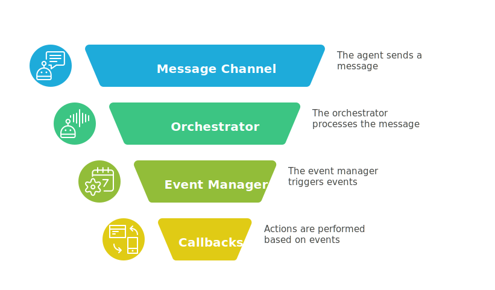
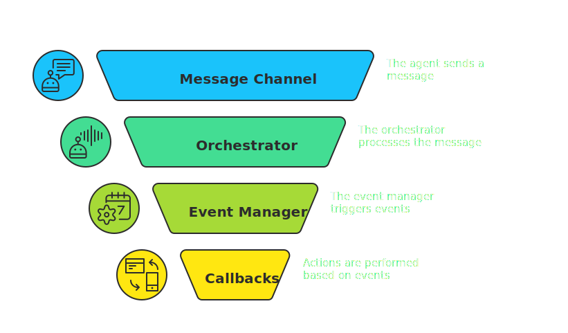
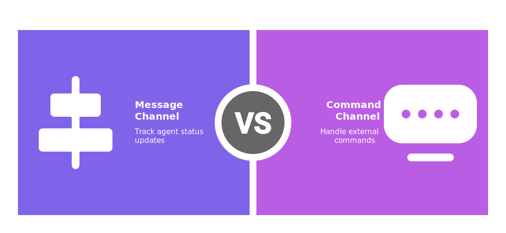
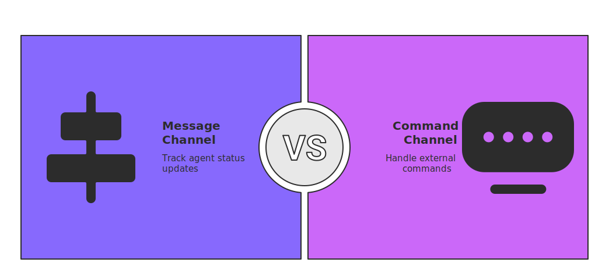

# Orchestrator

The **Orchestrator** is a central component responsible for coordinating multiple **Agents** and managing their lifecycle. It ensures seamless communication among **Agents** and serves as a single point for controlling the entire flow.

::: tip
For **more information**, see this [link](../core/orchestrator/index.md).
:::

### Why use Orchestrator?

It is not mandatory to use the Orchestrator, but it provides several advantages. Using the Orchestrator can help you automate the management of multiple agents (threads or processes), making it easier to coordinate their activities and ensuring that they work together effectively.

## Example

Here's an example of how to use the Orchestrator in your application.

```python
from PyOrchestrate.core.orchestrator import Orchestrator
from my_project.models import Publisher, Subscriber

if __name__ == "__main__":
    orchestrator = Orchestrator("Orchestrator")

    # register agents
    orchestrator.register_agent(Publisher, "Publisher")
    orchestrator.register_agent(Subscriber, "Subscriber")

    # start agent
    orchestrator.start()

    # wait for agent to complete
    orchestrator.join()
```

As shown in the example, the Orchestrator is initialized with a name and can register, start, and join multiple agents.

## Overview

### Configuration

Every Orchestrator has a set of **parameters** that define its own data. These parameters are stored in a `Config` object.

The `Config` class is used by the agent to **create a configuration object for itself**. 

::: info Example
See the [Config and Validation](../config_and_validation.md) section for more details on how to define and use configuration classes.
:::

### Run Mode

The Orchestrator can operate in different **run modes**, which control how long it stays alive after agents have completed.  

- **`STOP_ON_EMPTY`**  
  Works like a batch job.  
  The Orchestrator will **shut down automatically** once all agents have terminated and the queue is empty.  
  This is useful for pipelines or scripts where the orchestration has a clear start and end.

- **`DAEMON`**  
  Keeps the Orchestrator **alive indefinitely**, even when no agents are running.  
  This mode is designed for interactive or long-running systems where you want to control agents **manually or on-demand** — for example, through the **CLI or API commands**.  
  Agents can be started, stopped, or replaced at runtime without restarting the Orchestrator itself.


### Event Manager

{.light-only}
{.dark-only}

The **Event Manager** facilitates a set of **events** (`OrchestratorEvent`) that notify when something happens during the orchestration process (e.g., an agent completes). These events can be used as **signals** to perform specific actions (e.g., sending a message on Telegram).

**Event Flow:**
```
Agent → MessageChannel → Orchestrator → EventManager → Callbacks
```

Available events are stored in the `OrchestratorEvent` class:

| Event Name              | Arguments                     | Description                               |
|-------------------------|-------------------------------|-------------------------------------------|
| `AGENT_STARTED`         | `event_date`, `event_time`, `agent_name` | Emitted when an agent starts.             |
| `AGENT_READY`           | `event_date`, `event_time`, `agent_name` | Emitted when an agent is ready.           |
| `AGENT_TERMINATED`      | `event_date`, `event_time`, `agent_name` | Emitted when an agent terminates.         |
| `AGENT_ERROR`           | `event_date`, `event_time`, `agent_name` | Emitted when an agent encounters an error.  |

### Message Channels

{.light-only}
{.dark-only}

The Orchestrator communicates through two `MessageChannel` objects:

- **`message_channel`**: an in-memory queue where agents push their status updates (*started*, *ready*, *terminated*). The Orchestrator consumes these messages to track agent activity.  
- **`command_channel`**: a Unix domain socket used by external clients (like the CLI) to send commands or request data. It can be turned off in the config via `enable_command_interface` (enabled by default).  

Both channels are watched by a dedicated thread inside the Orchestrator.  
This thread continuously checks for new messages and routes them to the **Event Manager** or the proper handler, ensuring that every agent event or external command triggers the right callback.


## Create Orchestrator with custom Config

Sometimes you may want to customize how the Orchestrator runs (for example, changing the **check interval**, **enabling the command interface**, or switching the **run mode** between `DAEMON` and `STOP_ON_EMPTY`).

### Example

You can do this by creating a custom `Config` object and passing it to the **Orchestrator**. This gives you fine-grained control over its behavior while **still keeping the defaults** for any parameters you don’t specify.

```python
from PyOrchestrate.core.orchestrator import Orchestrator, RunMode

if __name__ == "__main__":
    # Configure orchestrator
    config = Orchestrator.Config(
        enable_command_interface=True,
        command_socket_path="/tmp/pyorchestrate.sock",
        run_mode=RunMode.DAEMON,
        check_interval=.25
    )
    orchestrator = Orchestrator("Orchestrator", config=config)
```

## Registering Agents

The Orchestrator allows you to **register agents** using the `register_agent` method. This method takes the `agent_class`, `name` and some optional parameters as arguments.

```python
orchestrator.register_agent(Publisher, "Publisher")
```

The available parameters are:

| Parameter        | Type            | Description                                                                 |
|------------------|-----------------|-----------------------------------------------------------------------------|
| `agent_class`    | Agent Class     | The agent class to be registered.                                           |
| `name`           | str             | The name of the agent. If not provided, the class name will be used.        |
| `custom_config`  | Config          | A custom configuration object for the agent. If not provided, the default config will be used. |
| `custom_plugin`  | Plugin          | A custom plugin object for the agent. If not provided, the default plugin will be used. |
| `control_events` | list            | A list of control events to be used by the agent. If not provided, the default events will be used. |
| `state_events`   | list            | A list of state events to be used by the agent. If not provided, the default events will be used. |
| `msg_channel`    | MessageChannel  | The message channel to be used by the agent. If not provided, the Orchestrator's default message channel will be used. |
| `kwargs`         | dict            | Additional keyword arguments to be passed to the agent constructor.         |

If you don't provide optional parameters, the Orchestrator will use the default values defined in the `Agent` class.

### Example

You can create multiple Agents of the same Agent class, each with its own configuration:

```python
custom_config = Publisher.Config(output_file="custom_file.txt")

orchestrator.register_agent(Publisher, "Pub1")
orchestrator.register_agent(Publisher, "Pub2")
orchestrator.register_agent(Publisher, "Pub3", custom_config=custom_config)
```

In this example, we create three `Publisher` agents. The first two use default settings, while the third writes to a custom output file.

::: tip
For more details on Agent's **Configuration**, **StateEvents** etc. check out the [Agent Overview](../agents/index.md#overview).
:::

## Registering Events

The Orchestrator can notify you when something important happens by **emitting events**.  
You can attach your own function to an event, making it act as a **callback**.  
This way, whenever the event is triggered, your function will run automatically.

```python
orchestrator.register_event(event_type, callback)
```

All available events are defined in the `OrchestratorEvent`, see [EventManager](#event-manager)

::: tip
Callbacks registered with `register_event` are invoked each time the event occurs for any agent that triggers it. Agent-related events include an `agent_name` argument so your callback can identify which agent fired the event.
:::

### Example

Here’s how you can register a callback for the `AGENT_STARTED` event:

```python
from PyOrchestrate.core.utilities.event import OrchestratorEvent

def send_telegram_message(event_date, event_time, agent_name):
    # Your logic to send a message on Telegram
    print(f"Agent {agent_name} started at {event_time}")

orchestrator.register_event(
    OrchestratorEvent.AGENT_STARTED,
    send_telegram_message,
)
```