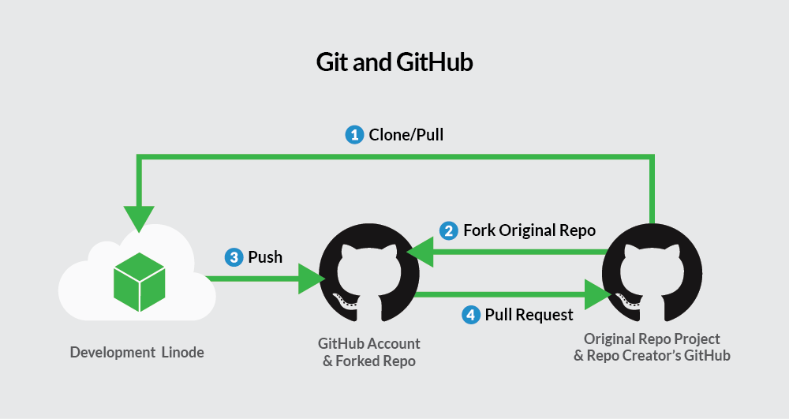
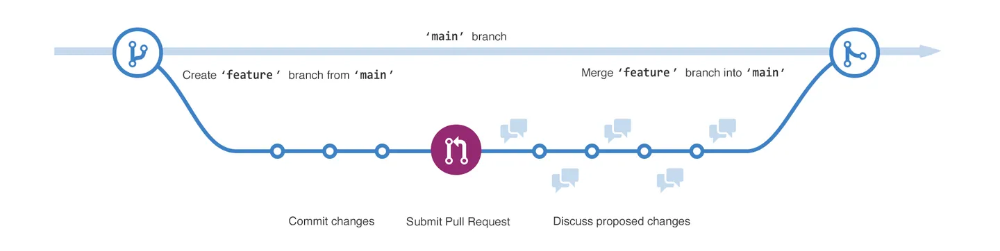

# Workflow

GitHub è uno strumento essenziale per chiunque si occupi di sviluppo software. Tuttavia, se sei nuovo al mondo della programmazione o della collaborazione su progetti, i concetti di **repository**, **branch**, **commit** e **pull request** potrebbero sembrare complessi. In questa guida, cercheremo di spiegare questi concetti fondamentali in modo semplice e chiaro.

## Cos'è un Repository?

Un **repository** (o "repo") su GitHub è come una cartella virtuale dove puoi memorizzare tutti i file relativi a un progetto. Può contenere codice, immagini, documenti o qualsiasi altro tipo di file che desideri gestire. I repository sono utili per tracciare la cronologia delle modifiche ai tuoi file e per collaborare con altri sviluppatori.

### Approfondimento
In GitHub, è pratica comune includere un file chiamato **README.md** in ogni repository. Questo file, scritto in Markdown, fornisce una descrizione del progetto, le istruzioni per l'uso e altre informazioni utili. I repository possono essere **pubblici** (visibili a tutti) o **privati** (accessibili solo a te e ai collaboratori che scegli).

---

## Branch: Versioni Parallele del Progetto

Un **branch** (ramo) è una versione separata del tuo repository. Immagina il branch principale (**main**) come la versione "ufficiale" del progetto, mentre i rami secondari sono versioni parallele che puoi usare per sperimentare o sviluppare nuove funzionalità.

### Approfondimento
I branch ti permettono di lavorare su funzionalità nuove o correzioni di bug senza modificare il codice del branch principale. Una volta che il tuo lavoro sul branch è completo e stabile, puoi unirlo di nuovo al branch principale tramite un **merge**. Questo sistema è molto utile in team di sviluppo, dove più persone lavorano contemporaneamente su diverse parti di un progetto.

::: tip Esempio 

Il diagramma mostra:

- Il branch main.
- Un nuovo ramo chiamato feature.
- Il percorso che segue feature prima del merge con il main.

:::

## Commit: Registrare le Modifiche

Quando apporti delle modifiche ai file nel tuo branch, devi "salvare" quelle modifiche tramite un **commit**. Un commit è una registrazione delle modifiche, accompagnata da un messaggio che descrive cosa hai cambiato e perché.

### Approfondimento
Ogni commit è come uno "scatto fotografico" del progetto in un preciso momento. Puoi sempre tornare indietro a uno specifico commit se qualcosa va storto. I commit sono fondamentali per mantenere la cronologia del progetto e per permettere agli altri sviluppatori di capire cosa è stato modificato e per quale motivo.

---

## Pull Request: Proporre Modifiche

Una **pull request** (PR) è il modo in cui chiedi di fondere le modifiche del tuo branch con un altro branch (tipicamente, il branch principale). È uno strumento essenziale per la collaborazione su GitHub.

### Approfondimento
Quando apri una pull request, gli altri membri del team possono esaminare il tuo codice, discutere i cambiamenti e proporre ulteriori modifiche. Questo processo di revisione del codice aiuta a migliorare la qualità del progetto e a prevenire bug o errori. Anche se stai lavorando da solo, è utile aprire pull request per tenere traccia delle tue modifiche e avere una visione chiara della cronologia del progetto.

::: tip
Le pull request sono il cuore della collaborazione su GitHub. Permettono di proporre modifiche, ottenere feedback e unirle al progetto principale solo quando tutto è stato esaminato e testato.
:::

---

## Il Flusso di Lavoro su GitHub

GitHub è costruito attorno a un flusso di lavoro chiamato **GitHub Flow**, che si compone di pochi, semplici passaggi:

1. **Creare un branch** per lavorare su una nuova funzionalità o correzione.
2. **Fare commit** per registrare le modifiche apportate ai file.
3. **Aprire una pull request** per proporre le modifiche e richiedere una revisione.
4. **Unire la pull request** al branch principale dopo che le modifiche sono state esaminate e approvate.

---

## Conclusione

GitHub è uno strumento incredibilmente potente per collaborare su progetti di sviluppo software, sia che tu stia lavorando da solo o in un team. I concetti di repository, branch, commit e pull request sono alla base del suo funzionamento. Una volta compresi questi concetti, sarai in grado di gestire progetti, collaborare con altri sviluppatori e tenere traccia di tutte le modifiche apportate al codice in modo efficace e ordinato.

Se vuoi continuare a esplorare GitHub, puoi consultare altre risorse o provare a personalizzare il tuo profilo GitHub.

---

### Letture consigliate

- [GitHub Flow](https://docs.github.com/en/get-started/quickstart/github-flow)
- [Introduzione a GitHub](https://skills.github.com/)