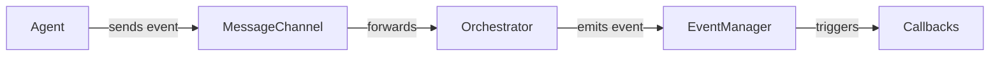

# Event Manager

The **Event Manager** in PyOrchestrate is a core component of the Orchestrator. It provides a robust, asynchronous, and type-safe mechanism for handling system-wide events related to agent lifecycle and orchestration.

## How It Works

- The Orchestrator owns a single EventManager instance.
- Agents never interact directly with the EventManager. Instead, they send messages to the Orchestrator via a MessageChannel.
- The Orchestrator receives these messages and emits the corresponding **OrchestratorEvent** through its EventManager.
- Users can register callbacks for these events using `orchestrator.register_event()`.

## Event Types

All events managed by the Orchestrator's EventManager are of type **OrchestratorEvent**. These include:

| Event Name                     | Arguments                                        | Description                               |
|--------------------------------|--------------------------------------------------|-------------------------------------------|
| `AGENT_STARTED`                |  `event_date`, `event_time`, `agent_name`        | Emitted when an agent starts.             |
| `AGENT_TERMINATED`             |  `event_date`, `event_time`, `agent_name`        | Emitted when an agent terminates.         |
| `ALL_AGENTS_TERMINATED`        |  `event_date`, `event_time`                      | Emitted when all agents have terminated.  |
| `AGENT_READY`                  |  `event_date`, `event_time`, `agent_name`        | Emitted when an agent signals readiness.  |
| `AGENT_ERROR`                  |  `event_date`, `event_time`, `agent_name`, `error_message` | Emitted when an agent reports an error.   |

## Registering Event Callbacks

To react to orchestration events, register your callback using the Orchestrator:

```python
from PyOrchestrate.core.orchestrator.events import OrchestratorEvent

def on_agent_started(agent_name, event_time, **kwargs):
    print(f"Agent {agent_name} started at {event_time}")

orchestrator.register_event(OrchestratorEvent.AGENT_STARTED, on_agent_started)
```

## Agent Events Through Orchestrator

When an agent changes state (start, ready, terminate, error), it sends a message to the Orchestrator via the MessageChannel. The Orchestrator then emits the corresponding OrchestratorEvent, triggering all registered callbacks for that event.

**Event flow:**


## Technical Details

### Parameter Filtering

When emitting an event, the EventManager automatically inspects the signature of each registered callback and only passes the parameters that the callback accepts. This allows you to write concise and type-safe handlers without worrying about extra arguments.

- If your callback only needs `agent_name`, it will only receive that.
- If you want full context, you can accept `**kwargs` to get all available data.

### Thread Pool & Asynchronous Execution

All event callbacks are executed asynchronously using a thread pool. This ensures that:
- Event emission never blocks the main orchestration loop.
- Slow or blocking callbacks do not delay other event handlers.
- The number of concurrent callback executions is limited by the thread pool size (default: 10).

### Error Isolation

If a callback raises an exception, the EventManager catches and logs the error, but continues executing all other callbacks for the same event. This guarantees that a bug in one handler does not affect the rest of the system.

### Shutdown

When the Orchestrator (or your application) is shutting down, the EventManager should be shut down gracefully to ensure all pending callbacks are completed. This is handled automatically, but you can also call:

```python
orchestrator.event_manager.shutdown()
```

This will wait for all running callbacks to finish and release resources.